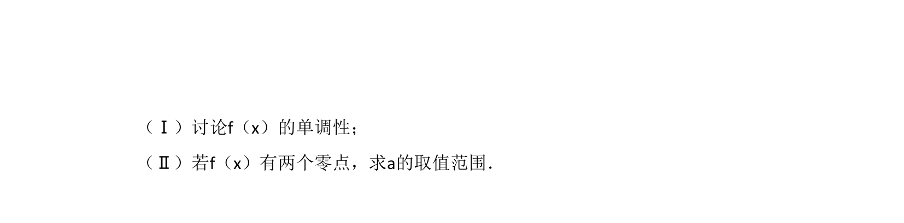
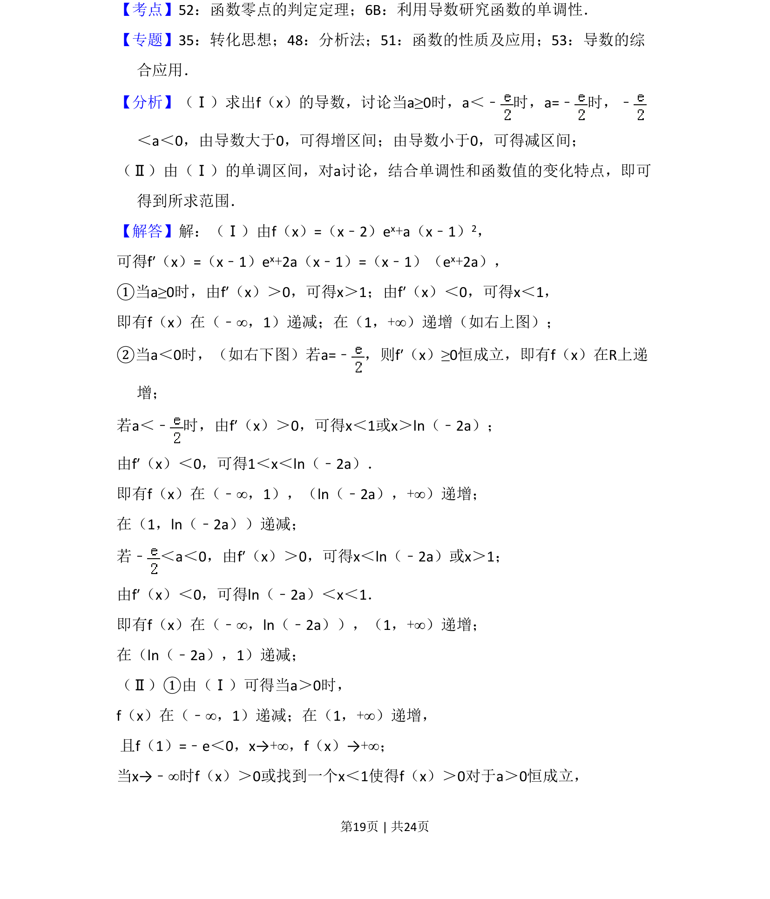
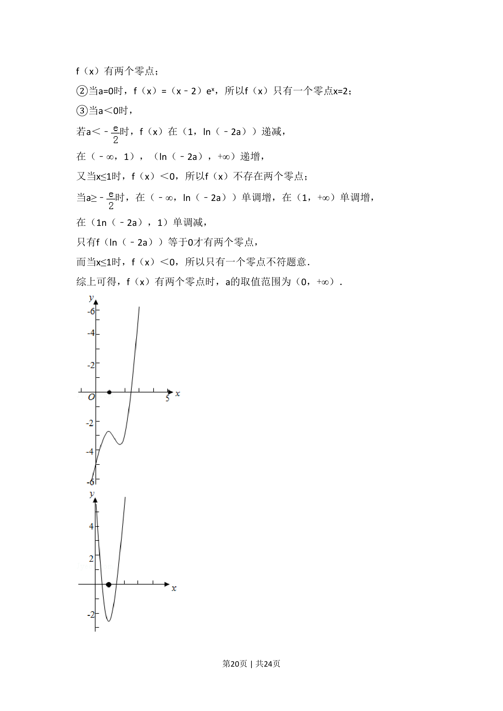
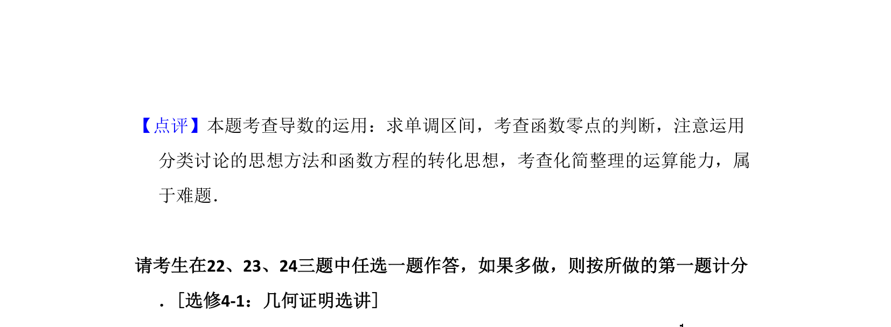

## 题面

## 摘要

本题主要考查含参数的函数单调性、极值及零点问题，需分类讨论。

## 关联考点

- [[425-反函数导数|导数]]
- [[432-导数与函数单调性|函数单调性]]
- [[286-函数的最值|极值]]
- [[424-参数分类讨论|分类讨论]]

## 答案与解析

> 📄 原 PDF 第 18 页：`素材/真题/湖南/2008-2024·（湖南）数学高考真题/2016年高考数学试卷（文）（新课标Ⅰ）（解析卷）.pdf`
