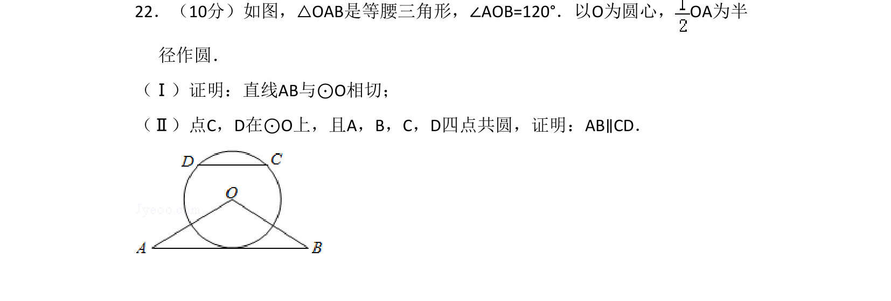
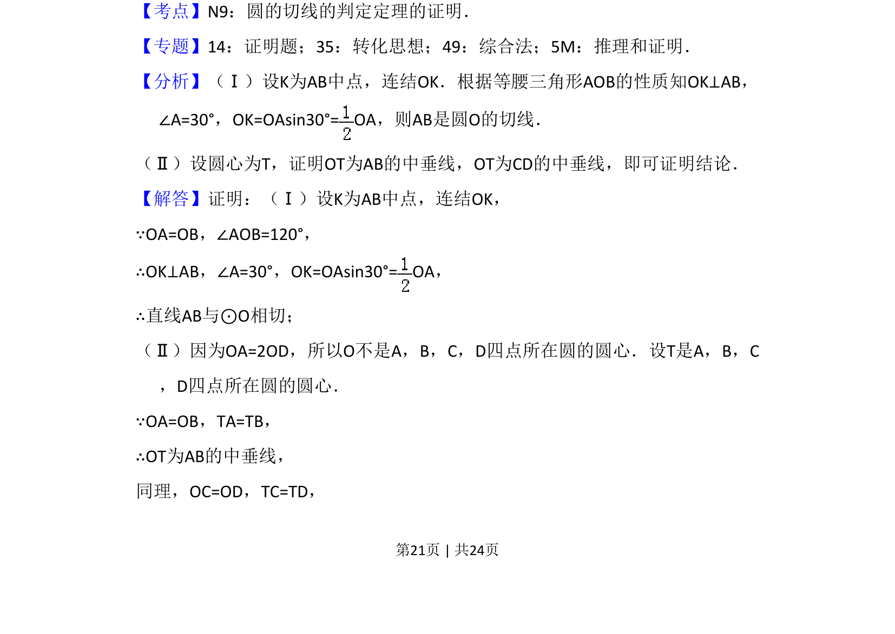
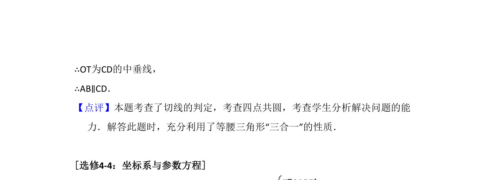

## 题面

## 摘要

该题考查等腰三角形与圆的切线判定，并通过四点共圆证明两直线平行。

## 关联考点

- [[圆的切线判定定理]]
- [[171-等腰三角形性质|等腰三角形性质]]
- [[四点共圆性质]]
- [[中垂线定理]]

## 答案与解析

> 📄 原 PDF 第 21 页：`素材/真题/湖南/2008-2024·（湖南）数学高考真题/2016年高考数学试卷（文）（新课标Ⅰ）（解析卷）.pdf`
