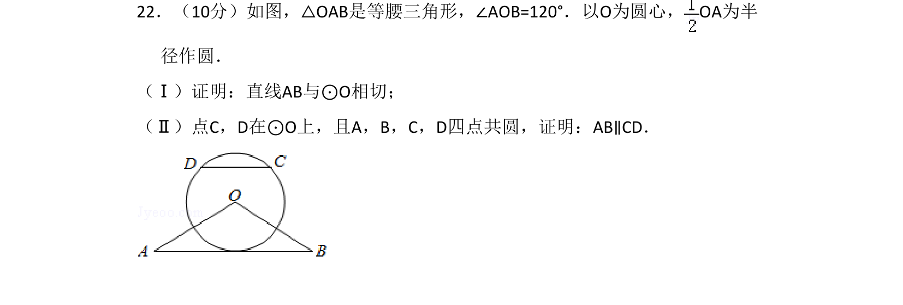
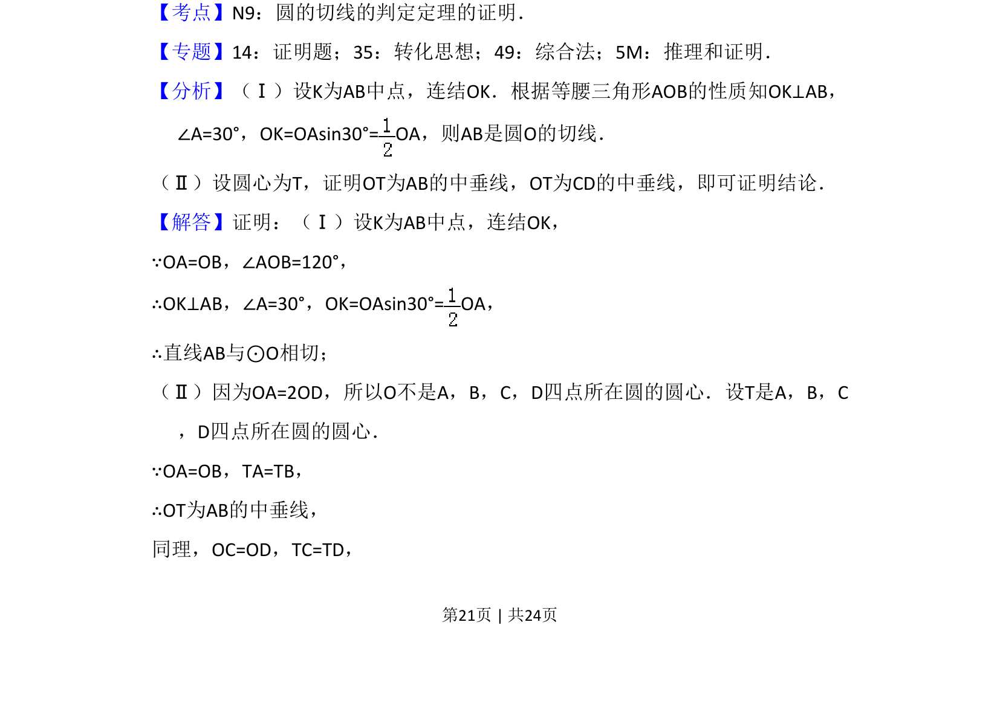
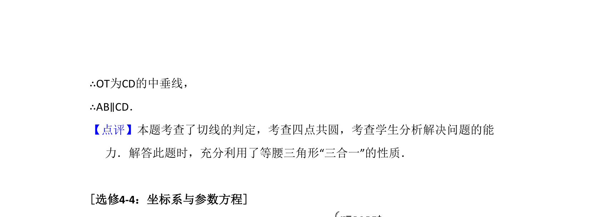

## 题面

## 摘要

该题考查等腰三角形与圆的切线判定，并通过四点共圆证明两直线平行。

## 关联考点

- [[圆的切线判定定理]]
- [[171-等腰三角形性质|等腰三角形性质]]
- [[四点共圆性质]]
- [[中垂线定理]]

## 答案与解析

> 📄 原 PDF 第 21 页：`素材/真题/湖南/2008-2024·（湖南）数学高考真题/2016年高考数学试卷（文）（新课标Ⅰ）（解析卷）.pdf`

<!-- 题干文本-start -->
## 题干文本
22．（10分）如图，△OAB是等腰三角形，∠AOB=120°．以O为圆心，OA为半
径作圆．
（Ⅰ）证明：直线AB与⊙O相切；
（Ⅱ）点C，D在⊙O上，且A，B，C，D四点共圆，证明：AB∥CD．
<!-- 题干文本-end -->

<!-- 解析文本-start -->
## 解析文本
【考点】N9：圆的切线的判定定理的证明．菁优网版权所有
【专题】14：证明题；35：转化思想；49：综合法；5M：推理和证明．
【分析】（Ⅰ）设K为AB中点，连结OK．根据等腰三角形AOB的性质知OK⊥AB，
∠A=30°，OK=OAsin30°= OA，则AB是圆O的切线．
（Ⅱ）设圆心为T，证明OT为AB的中垂线，OT为CD的中垂线，即可证明结论．
【解答】证明：（Ⅰ）设K为AB中点，连结OK，
∵OA=OB，∠AOB=120°，
∴OK⊥AB，∠A=30°，OK=OAsin30°= OA，
∴直线AB与⊙O相切；
（Ⅱ）因为OA=2OD，所以O不是A，B，C，D四点所在圆的圆心．设T是A，B，C
，D四点所在圆的圆心．
∵OA=OB，TA=TB，
∴OT为AB的中垂线，
同理，OC=OD，TC=TD，
<!-- 解析文本-end -->
