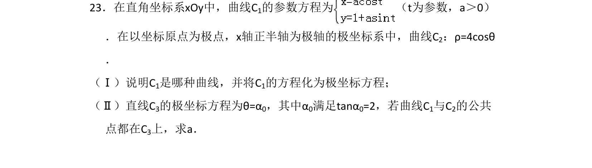
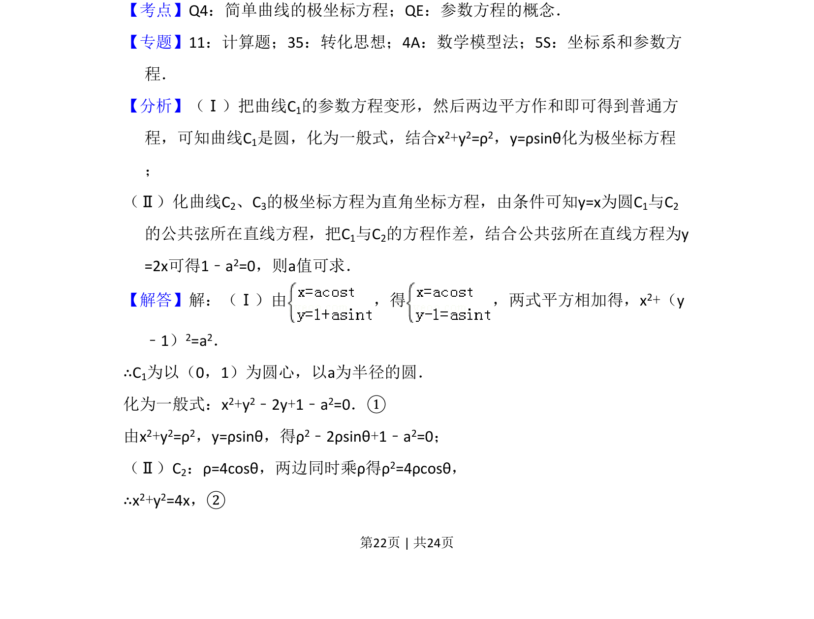
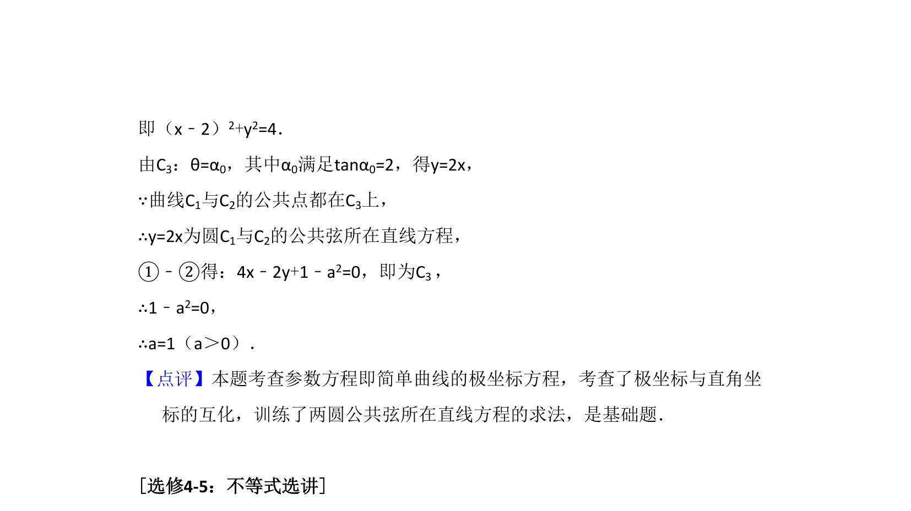

## 题面

## 摘要

将参数方程化为普通方程和极坐标方程，并利用公共弦条件求参数值。

## 关联考点

- [[061-方程|参数方程]]
- [[921-极坐标方程|极坐标方程]]
- [[782-圆的方程|圆的方程]]
- [[910-曲线交点|曲线交点]]

## 答案与解析

> 📄 原 PDF 第 22 页：`素材/真题/湖南/2008-2024·（湖南）数学高考真题/2016年高考数学试卷（文）（新课标Ⅰ）（解析卷）.pdf`
