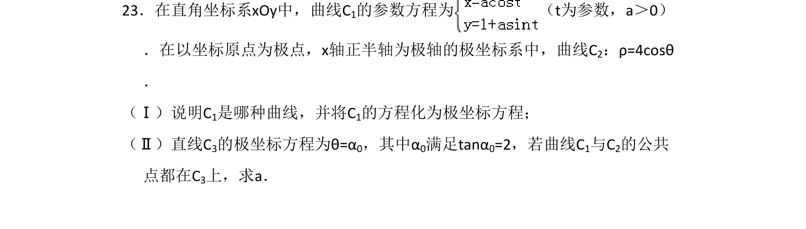
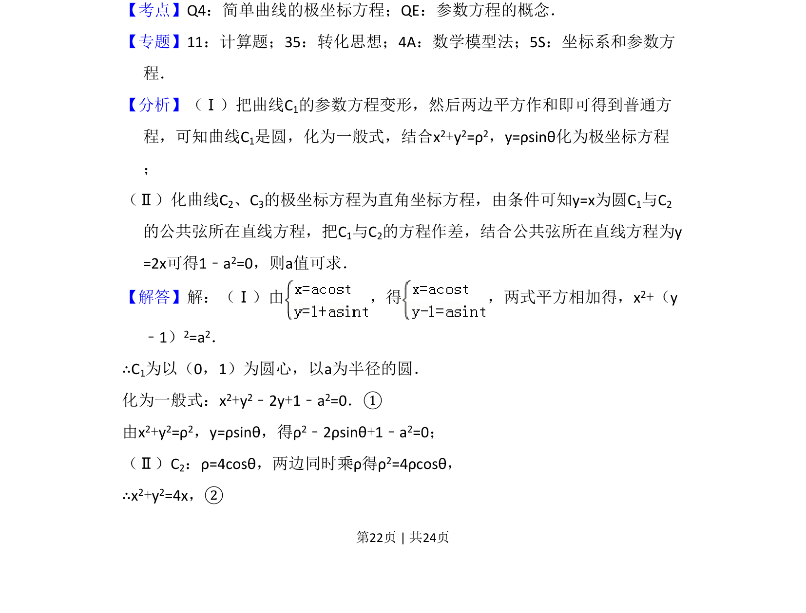
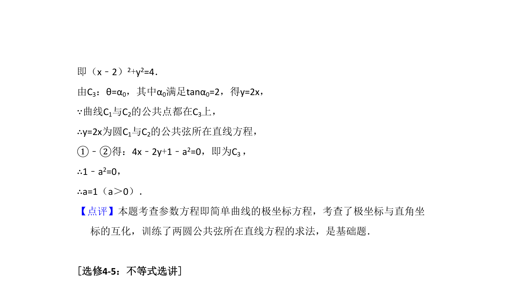

## 题面

## 摘要

将参数方程化为普通方程和极坐标方程，并利用公共弦条件求参数值。

## 关联考点

- [[061-方程|参数方程]]
- [[921-极坐标方程|极坐标方程]]
- [[782-圆的方程|圆的方程]]
- [[910-曲线交点|曲线交点]]

## 答案与解析

> 📄 原 PDF 第 22 页：`素材/真题/湖南/2008-2024·（湖南）数学高考真题/2016年高考数学试卷（文）（新课标Ⅰ）（解析卷）.pdf`

<!-- 题干文本-start -->
## 题干文本
23．在直角坐标系xOy中，曲线C1的参数方程为 （t为参数，a＞0）
．在以坐标原点为极点，x轴正半轴为极轴的极坐标系中，曲线C2：ρ=4cosθ
．
（Ⅰ）说明C1是哪种曲线，并将C1的方程化为极坐标方程；
（Ⅱ）直线C3的极坐标方程为θ=α0，其中α0满足tanα0=2，若曲线C1与C2的公共
点都在C3上，求a．
<!-- 题干文本-end -->

<!-- 解析文本-start -->
## 解析文本
【考点】Q4：简单曲线的极坐标方程；QE：参数方程的概念．菁优网版权所有
【专题】11：计算题；35：转化思想；4A：数学模型法；5S：坐标系和参数方
程．
【分析】（Ⅰ）把曲线C1的参数方程变形，然后两边平方作和即可得到普通方
程，可知曲线C1是圆，化为一般式，结合x2+y2=ρ2，y=ρsinθ化为极坐标方程
；
（Ⅱ）化曲线C2、C3的极坐标方程为直角坐标方程，由条件可知y=x为圆C1与C2
的公共弦所在直线方程，把C1与C2的方程作差，结合公共弦所在直线方程为y
=2x可得1﹣a2=0，则a值可求．
【解答】解：（Ⅰ）由 ，得 ，两式平方相加得，x 2+（y
﹣1）2=a2．
∴C1为以（0，1）为圆心，以a为半径的圆．
化为一般式：x2+y2﹣2y+1﹣a2=0．①
由x2+y2=ρ2，y=ρsinθ，得ρ2﹣2ρsinθ+1﹣a2=0；
（Ⅱ）C2：ρ=4cosθ，两边同时乘ρ得ρ2=4ρcosθ，
∴x2+y2=4x，②
<!-- 解析文本-end -->
