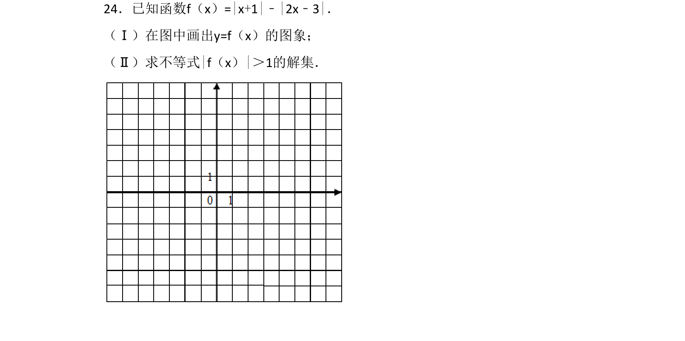
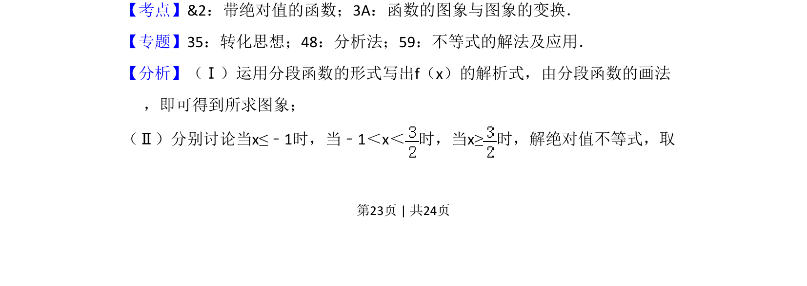
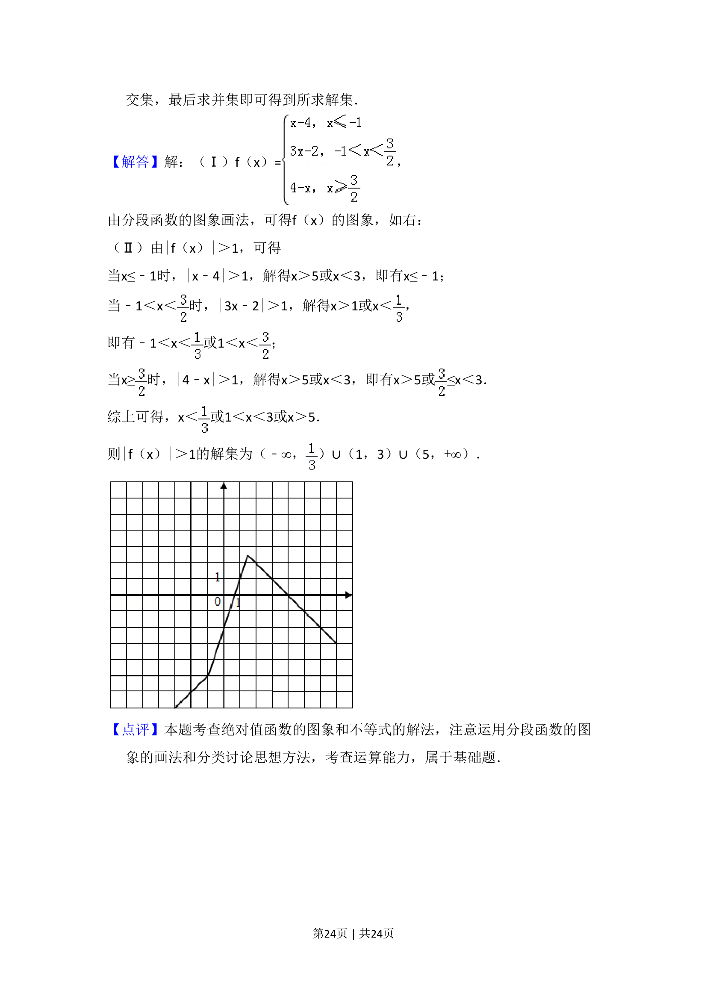

## 题面

## 摘要

考查含绝对值函数的图象画法与解绝对值不等式

## 关联考点

- [[带绝对值的函数]]
- [[689-函数的图象与图象的变换|函数的图象与图象的变换]]
- [[290-分段函数|分段函数]]
- [[1092-绝对值不等式|绝对值不等式]]

## 答案与解析

> 📄 原 PDF 第 23 页：`素材/真题/湖南/2008-2024·（湖南）数学高考真题/2016年高考数学试卷（文）（新课标Ⅰ）（解析卷）.pdf`
