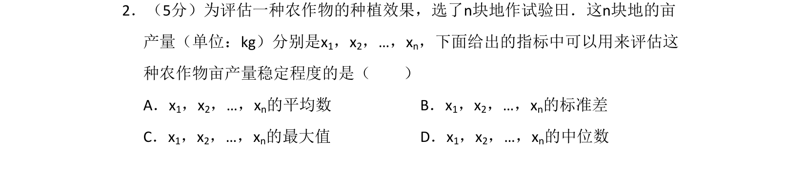
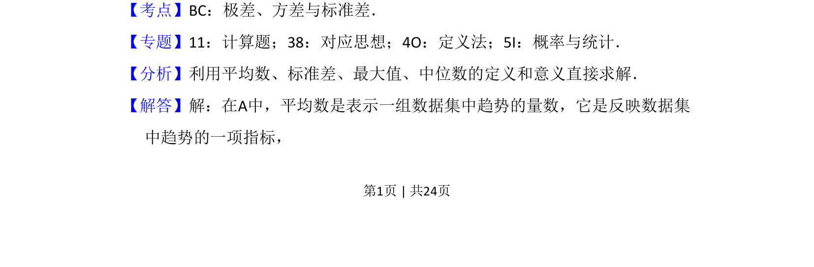
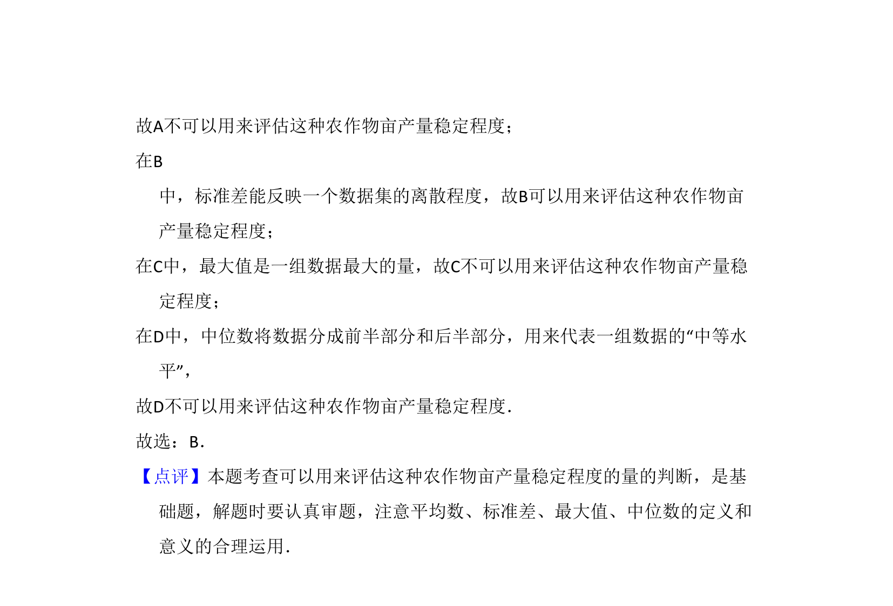

## 题面

## 摘要

评估农作物亩产量稳定程度的统计指标选择。

## 关联考点

- [[199-标准差|标准差]]
- [[198-方差|方差]]
- [[922-极差|极差]]
- [[数据波动]]

## 答案与解析

> 📄 原 PDF 第 1 页：`素材/真题/湖南/2008-2024·（湖南）数学高考真题/2017年高考数学试卷（文）（新课标Ⅰ）（解析卷）.pdf`

<!-- 题干文本-start -->
## 题干文本
2．（5分）为评估一种农作物的种植效果，选了n块地作试验田．这n块地的亩
产量（单位：kg）分别是x1，x2，…，xn，下面给出的指标中可以用来评估这
种农作物亩产量稳定程度的是（　　）
A．x1，x2，…，xn的平均数B．x 1，x2，…，xn的标准差
C．x1，x2，…，xn的最大值D．x 1，x2，…，xn的中位数
<!-- 题干文本-end -->

<!-- 解析文本-start -->
## 解析文本
【考点】BC：极差、方差与标准差．菁优网版权所有
【专题】11：计算题；38：对应思想；4O：定义法；5I：概率与统计．
【分析】利用平均数、标准差、最大值、中位数的定义和意义直接求解．
【解答】解：在A中，平均数是表示一组数据集中趋势的量数，它是反映数据集
中趋势的一项指标，
<!-- 解析文本-end -->
