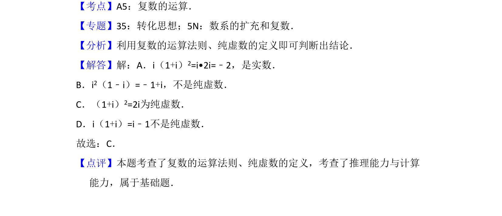

## 题面

## 摘要

该题考查复数的四则运算及纯虚数的判定，通过化简选项判断是否为纯虚数。

## 关联考点

- [[811-复数运算|复数运算]]
- [[纯虚数定义]]

## 答案与解析

> 📄 原 PDF 第 2 页：`素材/真题/湖南/2008-2024·（湖南）数学高考真题/2017年高考数学试卷（文）（新课标Ⅰ）（解析卷）.pdf`

<!-- 题干文本-start -->
## 题干文本
3．（5分）下列各式的运算结果为纯虚数的是（　　）
A．i（1+i）2 B．i2（1﹣i）C．（1+i） 2 D．i（1+i）
<!-- 题干文本-end -->

<!-- 解析文本-start -->
## 解析文本
【考点】A5：复数的运算．菁优网版权所有
【专题】35：转化思想；5N：数系的扩充和复数．
【分析】利用复数的运算法则、纯虚数的定义即可判断出结论．
【解答】解：A．i（1+i）2=i•2i=﹣2，是实数．
B．i2（1﹣i）=﹣1+i，不是纯虚数．
C．（1+i）2=2i为纯虚数．
D．i（1+i）=i﹣1不是纯虚数．
故选：C．
【点评】本题考查了复数的运算法则、纯虚数的定义，考查了推理能力与计算
能力，属于基础题．
<!-- 解析文本-end -->
