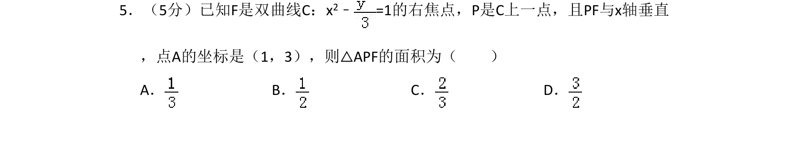
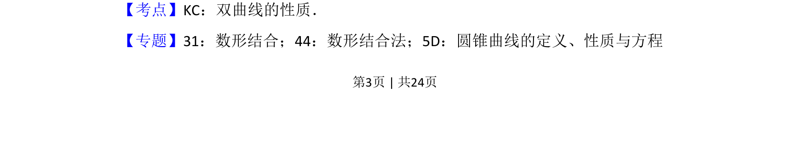
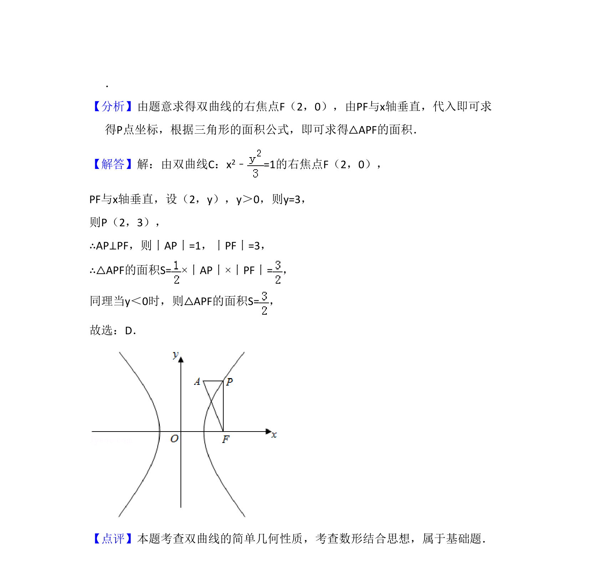

## 题面

## 摘要

已知双曲线方程和右焦点，点P在曲线上且PF与x轴垂直，求三角形面积。

## 关联考点

- [[731-双曲线的性质|双曲线的性质]]
- [[062-多边形面积|三角形面积]]
- [[897-数形结合|数形结合]]

## 答案与解析

> 📄 原 PDF 第 3 页：`素材/真题/湖南/2008-2024·（湖南）数学高考真题/2017年高考数学试卷（文）（新课标Ⅰ）（解析卷）.pdf`
