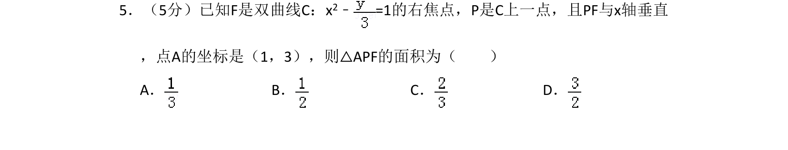
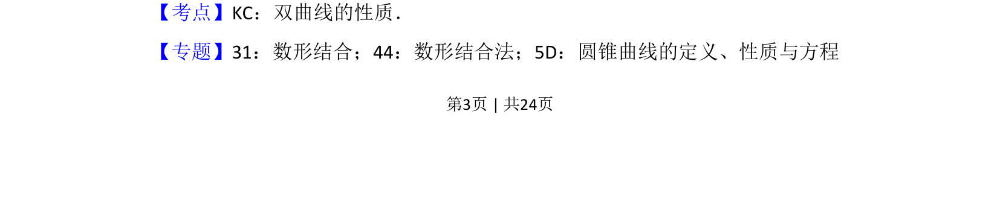
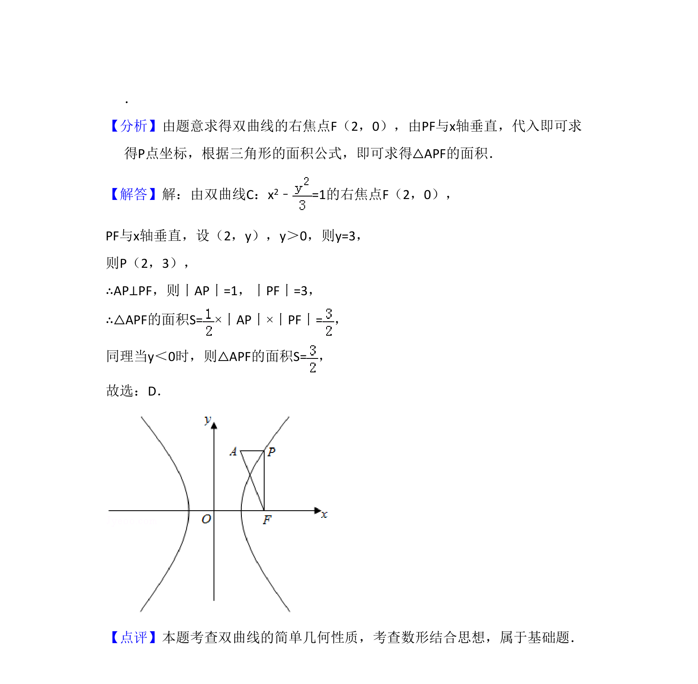

## 题面

## 摘要

已知双曲线方程和右焦点，点P在曲线上且PF与x轴垂直，求三角形面积。

## 关联考点

- [[731-双曲线的性质|双曲线的性质]]
- [[062-多边形面积|三角形面积]]
- [[897-数形结合|数形结合]]

## 答案与解析

> 📄 原 PDF 第 3 页：`素材/真题/湖南/2008-2024·（湖南）数学高考真题/2017年高考数学试卷（文）（新课标Ⅰ）（解析卷）.pdf`

<!-- 题干文本-start -->
## 题干文本
5．（5分）已知F是双曲线C：x2﹣=1的右焦点，P是C上一点，且PF与x轴垂直
，点A的坐标是（1，3），则△APF的面积为（　　）
A．B．C．D．
<!-- 题干文本-end -->

<!-- 解析文本-start -->
## 解析文本
【考点】KC：双曲线的性质．菁优网版权所有
【专题】31：数形结合；44：数形结合法；5D：圆锥曲线的定义、性质与方程
<!-- 解析文本-end -->
