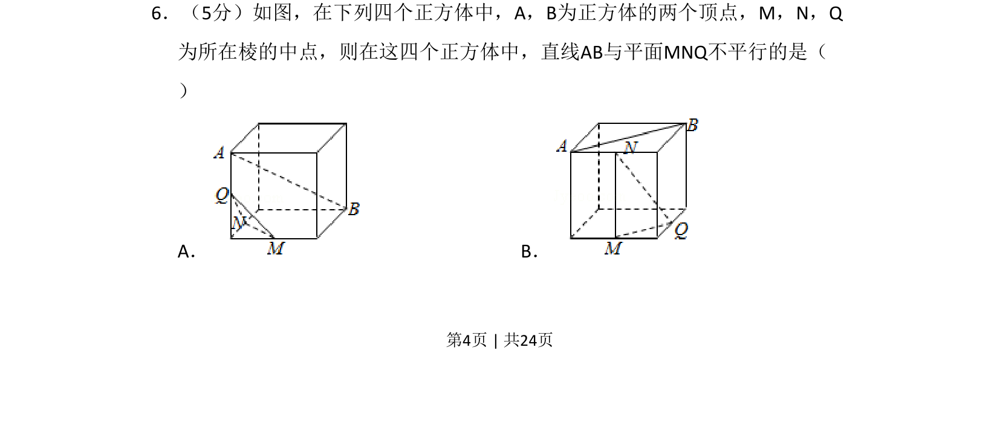
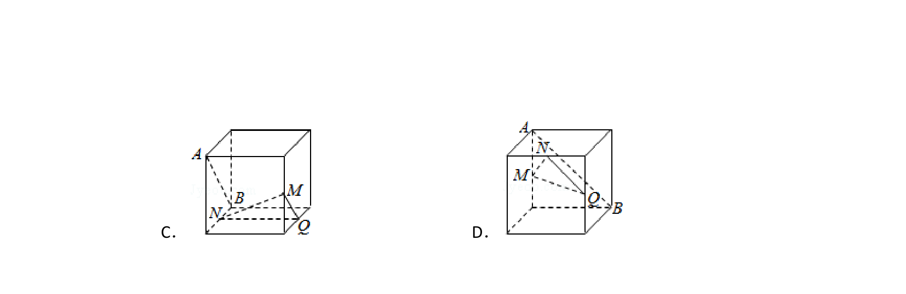
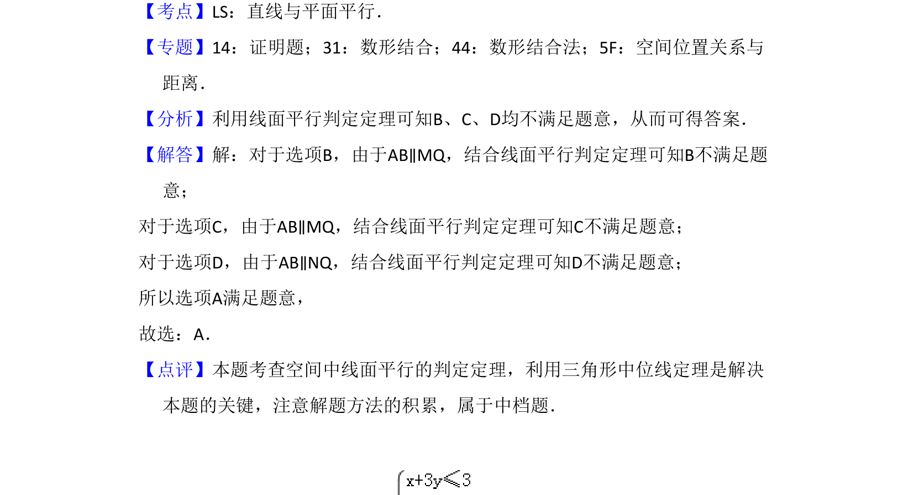

## 题面

## 摘要

判断正方体中直线与平面的平行关系，需分析线面位置关系。

## 关联考点

- [[352-空间直线平面平行|线面平行]]
- [[1195-正方体性质|正方体性质]]
- [[1053-空间想象|空间想象]]

## 答案与解析

> 📄 原 PDF 第 4 页：`素材/真题/湖南/2008-2024·（湖南）数学高考真题/2017年高考数学试卷（文）（新课标Ⅰ）（解析卷）.pdf`
