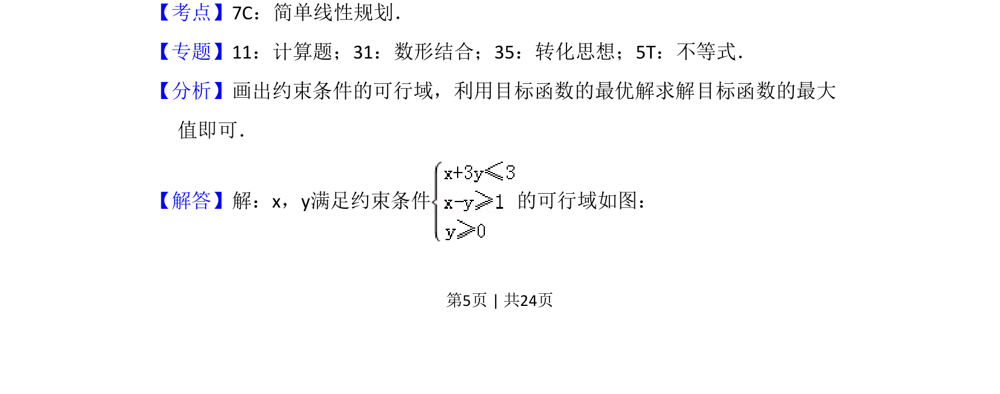
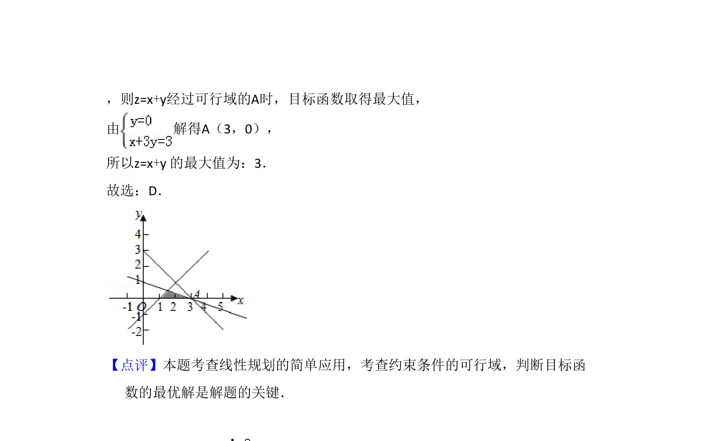

## 题面

## 摘要

考查线性规划问题，通过画出可行域并利用数形结合求目标函数的最大值。

## 关联考点

- [[1074-简单线性规划|简单线性规划]]
- [[897-数形结合|数形结合]]
- [[1000-目标函数最值|目标函数最值]]

## 答案与解析

> 📄 原 PDF 第 5 页：`素材/真题/湖南/2008-2024·（湖南）数学高考真题/2017年高考数学试卷（文）（新课标Ⅰ）（解析卷）.pdf`

<!-- 题干文本-start -->
## 题干文本
7．（5分）设x，y满足约束条件 ，则z=x+y的最大值为（　　）
A．0 B．1 C．2 D．3
<!-- 题干文本-end -->

<!-- 解析文本-start -->
## 解析文本
【考点】7C：简单线性规划．菁优网版权所有
【专题】11：计算题；31：数形结合；35：转化思想；5T：不等式．
【分析】画出约束条件的可行域，利用目标函数的最优解求解目标函数的最大
值即可．
【解答】解：x，y满足约束条件 的可行域如图：
<!-- 解析文本-end -->
