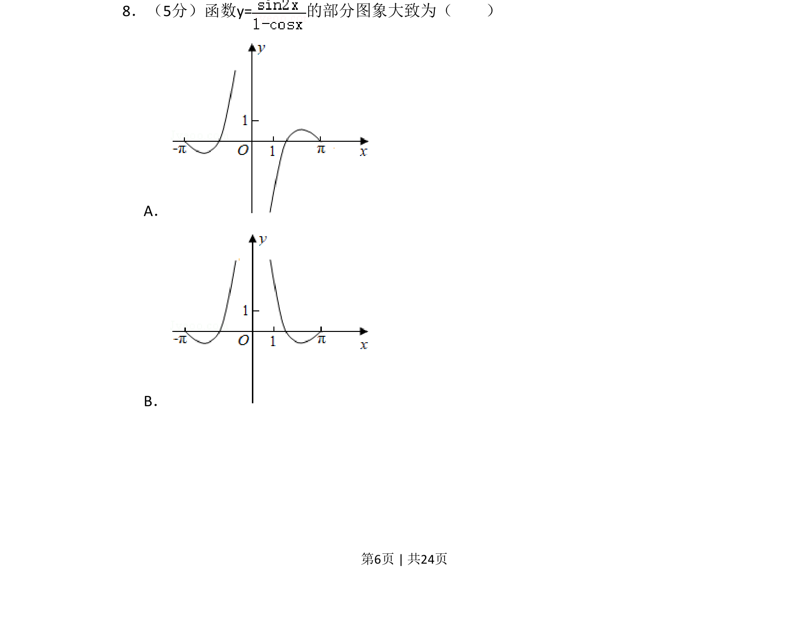
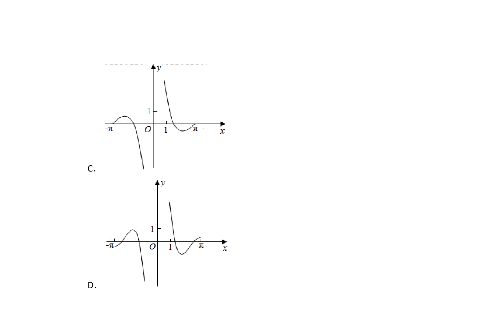
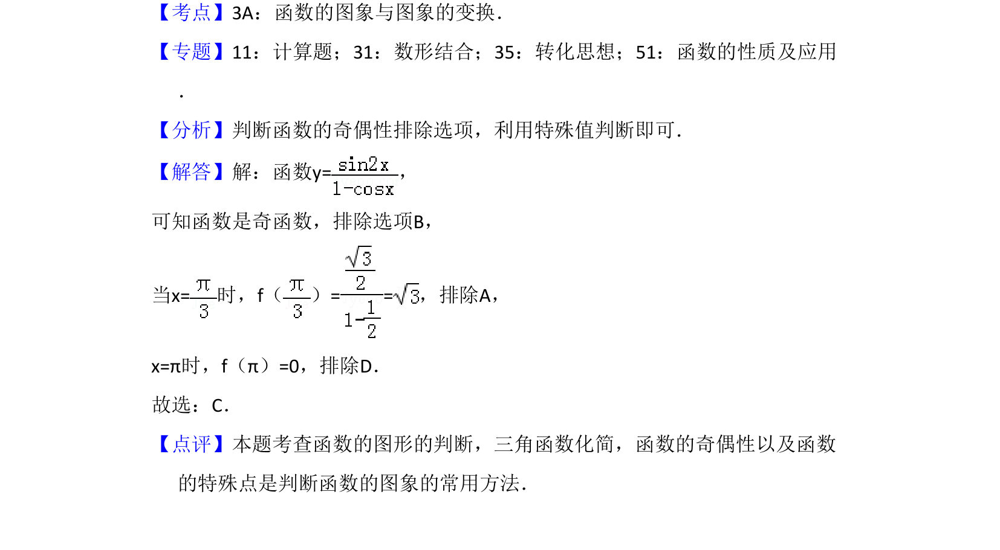

## 题面

## 摘要

该题考查通过函数解析式判断函数图象大致形状，需结合定义域、奇偶性、特殊点及单调性进行分析。

## 关联考点

- [[函数图象判断]]
- [[817-奇偶性|奇偶性]]
- [[1267-函数的定义域与值域|定义域]]
- [[719-单调性|单调性]]

## 答案与解析

> 📄 原 PDF 第 6 页：`素材/真题/湖南/2008-2024·（湖南）数学高考真题/2017年高考数学试卷（文）（新课标Ⅰ）（解析卷）.pdf`
