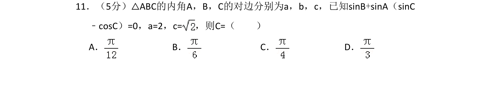
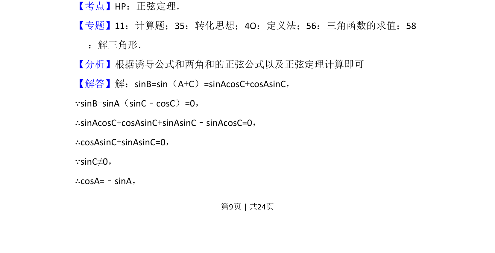
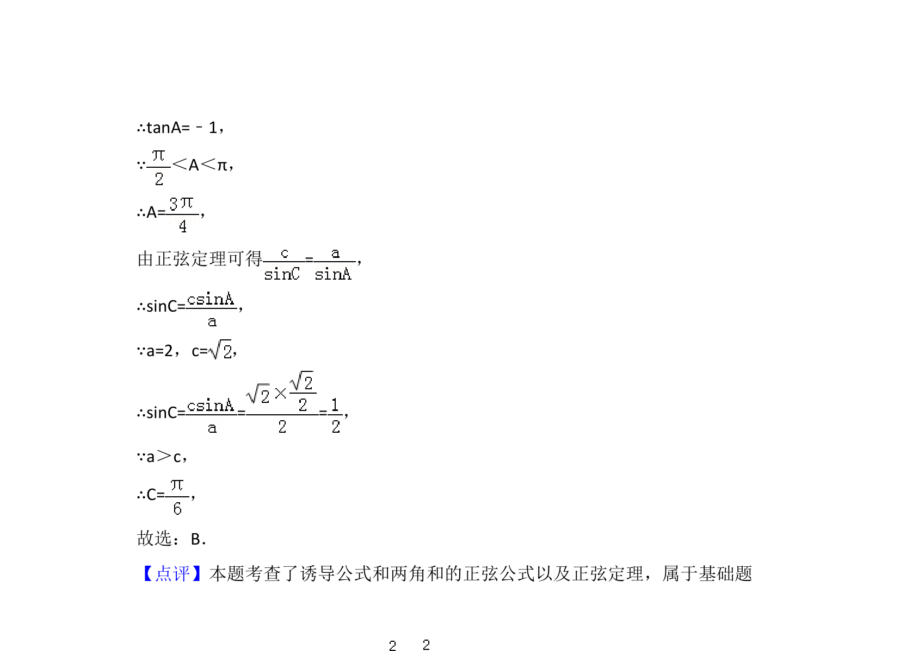

## 题面

## 摘要

已知部分角和边的关系，利用正弦定理及三角恒等变换求角，属于解三角形常规题。

## 关联考点

- [[126-定理|正弦定理]]
- [[634-两角和的正弦公式|两角和的正弦公式]]
- [[589-解三角形|解三角形]]

## 答案与解析

> 📄 原 PDF 第 9 页：`素材/真题/湖南/2008-2024·（湖南）数学高考真题/2017年高考数学试卷（文）（新课标Ⅰ）（解析卷）.pdf`
