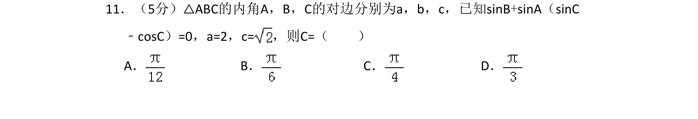
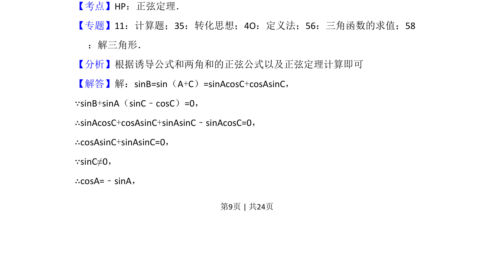
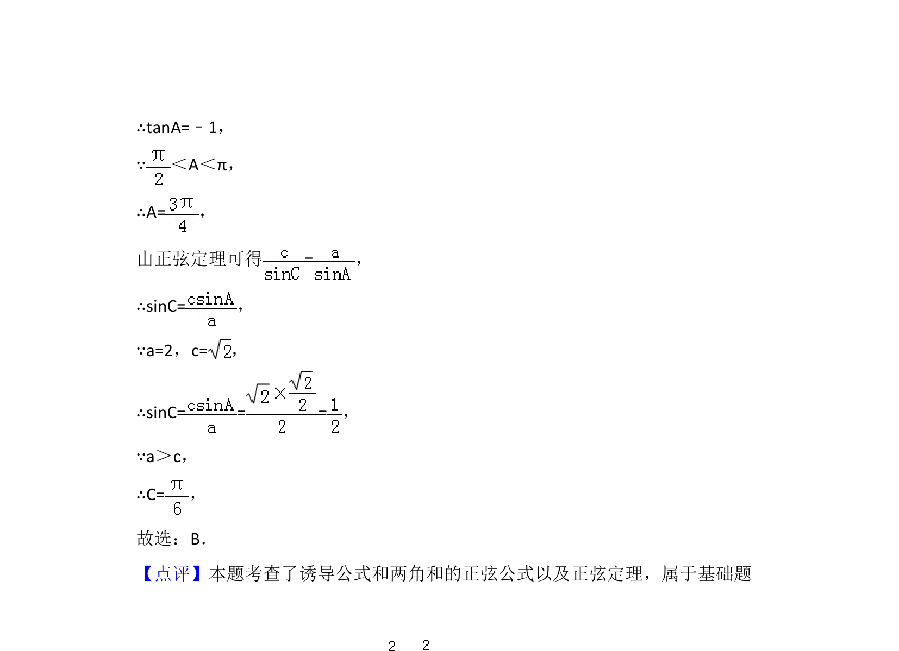

## 题面

## 摘要

已知部分角和边的关系，利用正弦定理及三角恒等变换求角，属于解三角形常规题。

## 关联考点

- [[126-定理|正弦定理]]
- [[634-两角和的正弦公式|两角和的正弦公式]]
- [[589-解三角形|解三角形]]

## 答案与解析

> 📄 原 PDF 第 9 页：`素材/真题/湖南/2008-2024·（湖南）数学高考真题/2017年高考数学试卷（文）（新课标Ⅰ）（解析卷）.pdf`

<!-- 题干文本-start -->
## 题干文本
11．（5分）△ABC的内角A，B，C的对边分别为a，b，c，已知sinB+sinA（sinC
﹣cosC）=0，a=2，c=，则C=（　　）
A．B．C．D．
<!-- 题干文本-end -->

<!-- 解析文本-start -->
## 解析文本
【考点】HP：正弦定理．菁优网版权所有
【专题】11：计算题；35：转化思想；4O：定义法；56：三角函数的求值；58
：解三角形．
【分析】根据诱导公式和两角和的正弦公式以及正弦定理计算即可
【解答】解：sinB=sin（A+C）=sinAcosC+cosAsinC，
∵sinB+sinA（sinC﹣cosC）=0，
∴sinAcosC+cosAsinC+sinAsinC﹣sinAcosC=0，
∴cosAsinC+sinAsinC=0，
∵sinC≠0，
∴cosA=﹣sinA，
<!-- 解析文本-end -->
