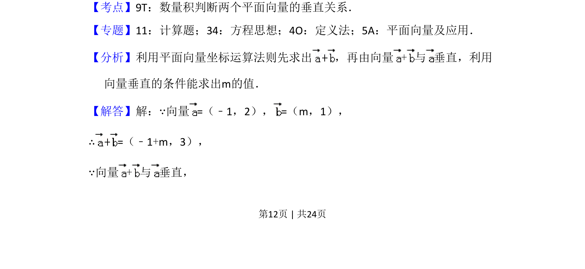
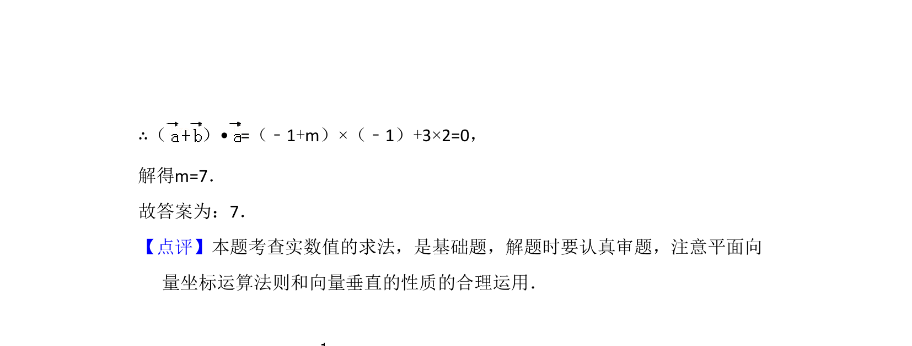

## 题面

## 摘要

已知两向量坐标及垂直关系，求参数 m 的值。

## 关联考点

- [[335-平面向量坐标运算|平面向量坐标运算]]
- [[数量积判断垂直关系]]

## 答案与解析

> 📄 原 PDF 第 12 页：`素材/真题/湖南/2008-2024·（湖南）数学高考真题/2017年高考数学试卷（文）（新课标Ⅰ）（解析卷）.pdf`

<!-- 题干文本-start -->
## 题干文本
13．（5分）已知向量=（﹣1，2），=（m，1），若向量+与 垂直，则m
=　7　．
<!-- 题干文本-end -->

<!-- 解析文本-start -->
## 解析文本
【考点】9T：数量积判断两个平面向量的垂直关系．菁优网版权所有
【专题】11：计算题；34：方程思想；4O：定义法；5A：平面向量及应用．
【分析】利用平面向量坐标运算法则先求出 ，再由向量+与 垂直，利用
向量垂直的条件能求出m的值．
【解答】解：∵向量=（﹣1，2），=（m，1），
∴=（﹣1+m，3），
∵向量+与 垂直，
<!-- 解析文本-end -->
