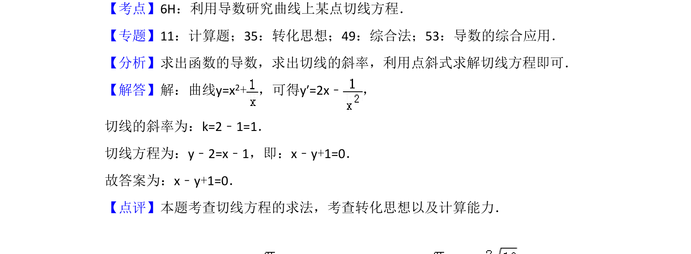

## 题面

## 摘要

求曲线在给定点的切线方程，涉及求导、斜率计算和点斜式方程。

## 关联考点

- [[导数及其几何意义]]
- [[422-切线方程|切线方程]]
- [[398-直线方程-点斜式|点斜式]]

## 答案与解析

> 📄 原 PDF 第 13 页：`素材/真题/湖南/2008-2024·（湖南）数学高考真题/2017年高考数学试卷（文）（新课标Ⅰ）（解析卷）.pdf`

<!-- 题干文本-start -->
## 题干文本
14．（5分）曲线y=x2+在点（1，2）处的切线方程为　x﹣y+1=0　．
<!-- 题干文本-end -->

<!-- 解析文本-start -->
## 解析文本
【考点】6H：利用导数研究曲线上某点切线方程．菁优网版权所有
【专题】11：计算题；35：转化思想；49：综合法；53：导数的综合应用．
【分析】求出函数的导数，求出切线的斜率，利用点斜式求解切线方程即可．
【解答】解：曲线y=x2+，可得y′=2x﹣ ，
切线的斜率为：k=2﹣1=1．
切线方程为：y﹣2=x﹣1，即：x﹣y+1=0．
故答案为：x﹣y+1=0．
【点评】本题考查切线方程的求法，考查转化思想以及计算能力．
<!-- 解析文本-end -->
