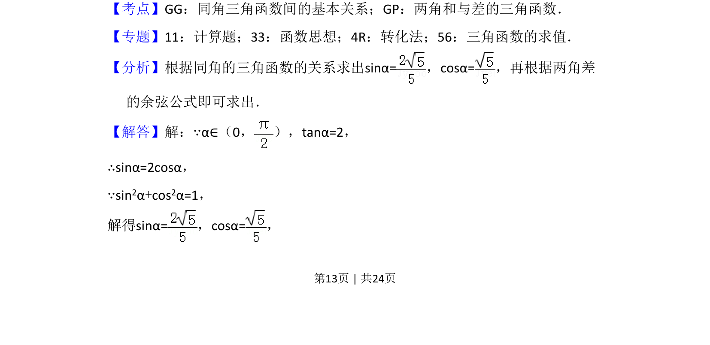
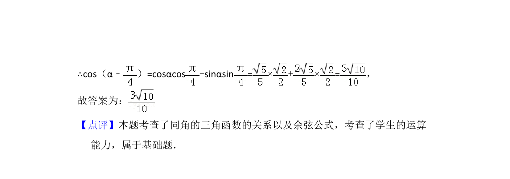

## 题面

## 摘要

已知角的正切值，利用同角关系求正余弦，再代入两角差余弦公式计算。

## 关联考点

- [[741-同角三角函数基本关系|同角三角函数基本关系]]
- [[628-两角和与差的三角函数|两角和与差的三角函数]]
- [[三角求值]]

## 答案与解析

> 📄 原 PDF 第 13 页：`素材/真题/湖南/2008-2024·（湖南）数学高考真题/2017年高考数学试卷（文）（新课标Ⅰ）（解析卷）.pdf`
