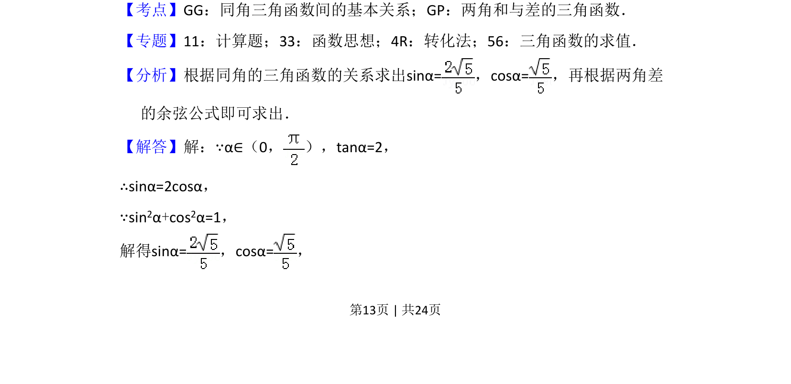
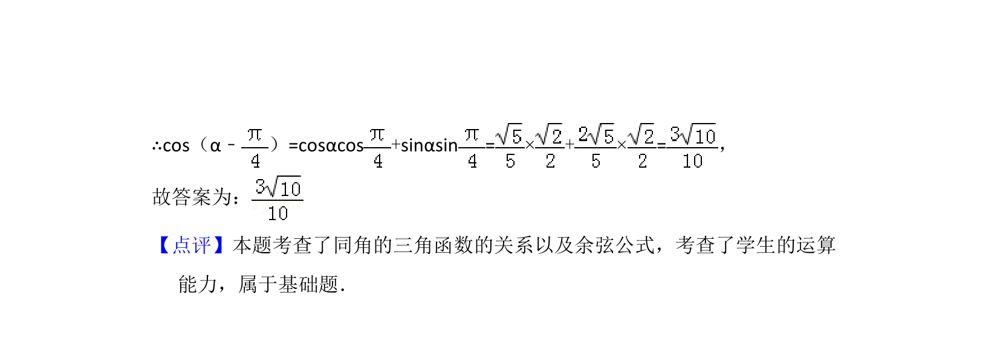

## 题面

## 摘要

已知角的正切值，利用同角关系求正余弦，再代入两角差余弦公式计算。

## 关联考点

- [[741-同角三角函数基本关系|同角三角函数基本关系]]
- [[628-两角和与差的三角函数|两角和与差的三角函数]]
- [[三角求值]]

## 答案与解析

> 📄 原 PDF 第 13 页：`素材/真题/湖南/2008-2024·（湖南）数学高考真题/2017年高考数学试卷（文）（新课标Ⅰ）（解析卷）.pdf`

<!-- 题干文本-start -->
## 题干文本
15．（5分）已知α∈（0， ），tanα=2，则cos（α﹣ ）=　 　．
<!-- 题干文本-end -->

<!-- 解析文本-start -->
## 解析文本
【考点】GG：同角三角函数间的基本关系；GP：两角和与差的三角函数．菁优网版权所有
【专题】11：计算题；33：函数思想；4R：转化法；56：三角函数的求值．
【分析】根据同角的三角函数的关系求出sinα=，cosα=，再根据两角差
的余弦公式即可求出．
【解答】解：∵α∈（0， ），tanα=2，
∴sinα=2cosα，
∵sin2α+cos2α=1，
解得sinα=，cosα=，
<!-- 解析文本-end -->
