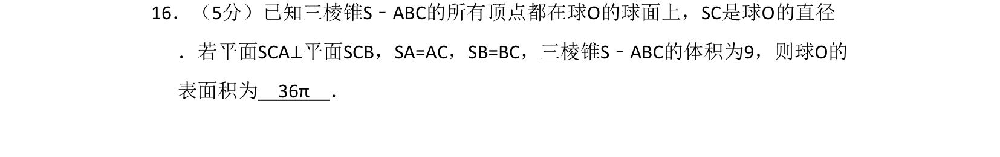
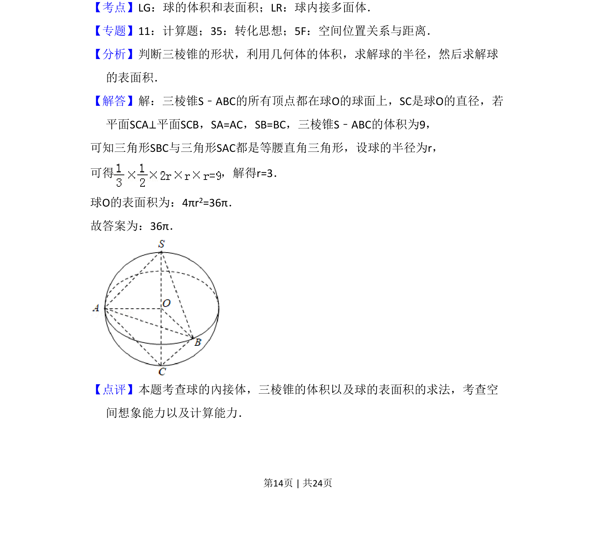
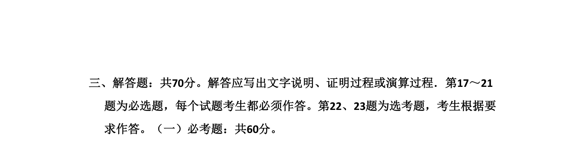

## 题面

## 摘要

三棱锥内接于球，利用面面垂直与线段相等关系，通过体积求球半径，进而计算球的表面积。

## 关联考点

- [[988-球内接多面体|球内接多面体]]
- [[993-球的表面积|球的表面积]]
- [[1191-三棱锥体积|三棱锥体积]]
- [[1397-平面与平面垂直|面面垂直]]

## 答案与解析

> 📄 原 PDF 第 14 页：`素材/真题/湖南/2008-2024·（湖南）数学高考真题/2017年高考数学试卷（文）（新课标Ⅰ）（解析卷）.pdf`
