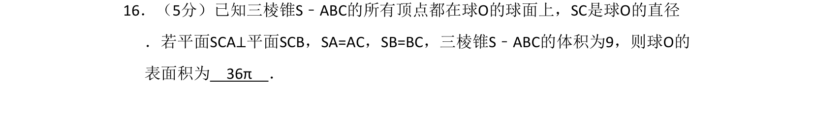
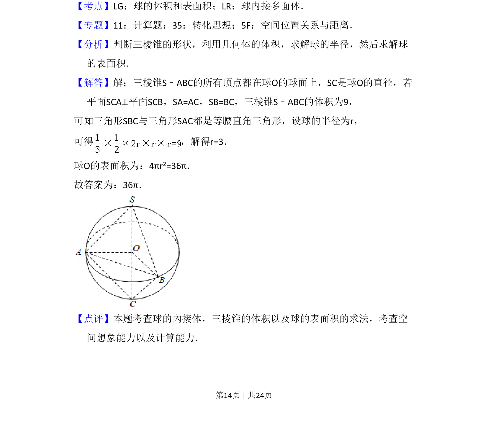
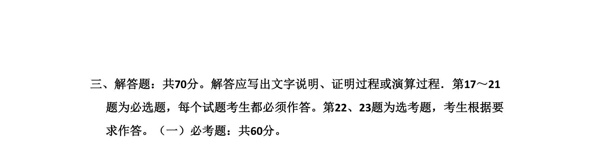

## 题面

## 摘要

三棱锥内接于球，利用面面垂直与线段相等关系，通过体积求球半径，进而计算球的表面积。

## 关联考点

- [[988-球内接多面体|球内接多面体]]
- [[993-球的表面积|球的表面积]]
- [[1191-三棱锥体积|三棱锥体积]]
- [[1397-平面与平面垂直|面面垂直]]

## 答案与解析

> 📄 原 PDF 第 14 页：`素材/真题/湖南/2008-2024·（湖南）数学高考真题/2017年高考数学试卷（文）（新课标Ⅰ）（解析卷）.pdf`

<!-- 题干文本-start -->
## 题干文本
16．（5分）已知三棱锥S﹣ABC的所有顶点都在球O的球面上，SC是球O的直径
．若平面SCA⊥平面SCB，SA=AC，SB=BC，三棱锥S﹣ABC的体积为9，则球O的
表面积为　36π　．
<!-- 题干文本-end -->

<!-- 解析文本-start -->
## 解析文本
【考点】LG：球的体积和表面积；LR：球内接多面体．菁优网版权所有
【专题】11：计算题；35：转化思想；5F：空间位置关系与距离．
【分析】判断三棱锥的形状，利用几何体的体积，求解球的半径，然后求解球
的表面积．
【解答】解：三棱锥S﹣ABC的所有顶点都在球O的球面上，SC是球O的直径，若
平面SCA⊥平面SCB，SA=AC，SB=BC，三棱锥S﹣ABC的体积为9，
可知三角形SBC与三角形SAC都是等腰直角三角形，设球的半径为r，
可得 ，解得r=3．
球O的表面积为：4πr2=36π．
故答案为：36π．
【点评】本题考查球的內接体，三棱锥的体积以及球的表面积的求法，考查空
间想象能力以及计算能力．
<!-- 解析文本-end -->
