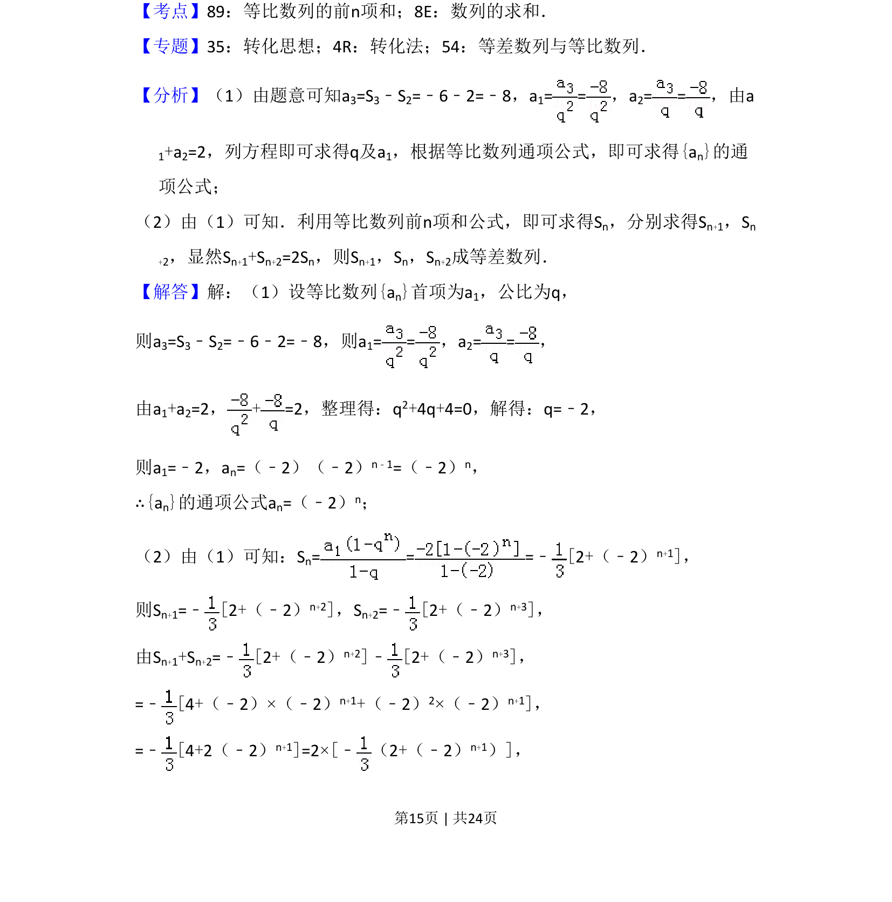
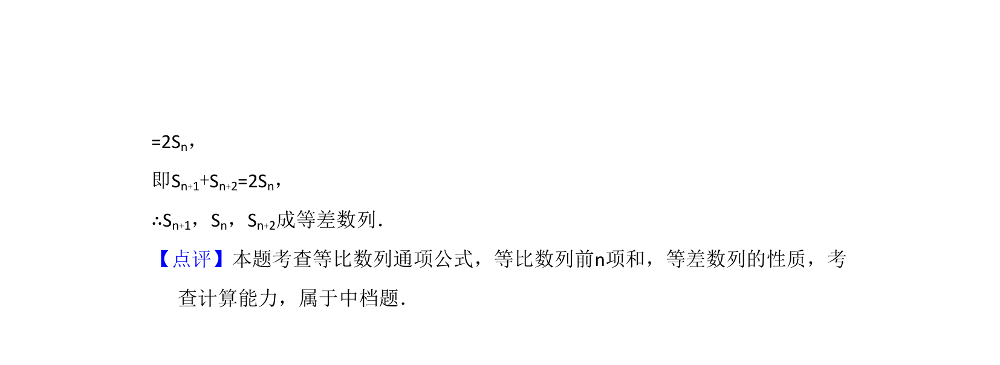

## 题面

## 摘要

等比数列已知前两项和与前三项和，求通项公式并判定连续三项和是否成等差数列

## 关联考点

- [[1069-等比数列的通项公式|等比数列的通项公式]]
- [[1066-等比数列的前n项和|等比数列的前n项和]]
- [[等差数列的判定]]

## 答案与解析

> 📄 原 PDF 第 15 页：`素材/真题/湖南/2008-2024·（湖南）数学高考真题/2017年高考数学试卷（文）（新课标Ⅰ）（解析卷）.pdf`
