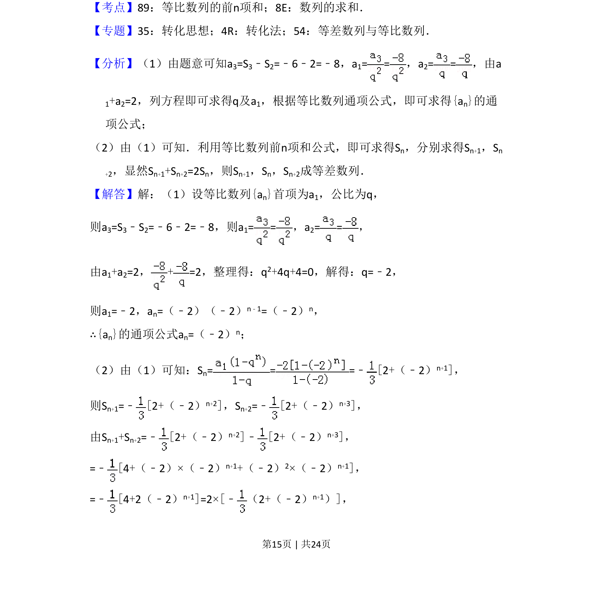
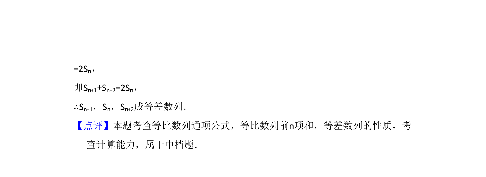

## 题面

## 摘要

等比数列已知前两项和与前三项和，求通项公式并判定连续三项和是否成等差数列

## 关联考点

- [[1070-等比数列通项公式|等比数列的通项公式]]
- [[357-等比数列前n项和|等比数列的前n项和]]
- [[等差数列的判定]]

## 答案与解析

> 📄 原 PDF 第 15 页：`素材/真题/湖南/2008-2024·（湖南）数学高考真题/2017年高考数学试卷（文）（新课标Ⅰ）（解析卷）.pdf`

<!-- 题干文本-start -->
## 题干文本
17．（12分）记Sn为等比数列{an}的前n项和．已知S2=2，S3=﹣6．
（1）求{an}的通项公式；
（2）求Sn，并判断Sn+1，Sn，Sn+2是否成等差数列．
<!-- 题干文本-end -->

<!-- 解析文本-start -->
## 解析文本
【考点】89：等比数列的前n项和；8E：数列的求和．菁优网版权所有
【专题】35：转化思想；4R：转化法；54：等差数列与等比数列．
【分析】（1）由题意可知a3=S3﹣S2=﹣6﹣2=﹣8，a1= =，a 2= =，由a
1+a2=2，列方程即可求得q及a1，根据等比数列通项公式，即可求得{an}的通
项公式；
（2）由（1）可知．利用等比数列前n项和公式，即可求得Sn，分别求得Sn+1，Sn
+2，显然Sn+1+Sn+2=2Sn，则Sn+1，Sn，Sn+2成等差数列．
【解答】解：（1）设等比数列{an}首项为a1，公比为q，
则a3=S3﹣S2=﹣6﹣2=﹣8，则a1= =，a 2= =，
由a1+a2=2，+=2，整理得：q 2+4q+4=0，解得：q=﹣2，
则a1=﹣2，an=（﹣2）（﹣2）n﹣1=（﹣2）n，
∴{an}的通项公式an=（﹣2）n；
（2）由（1）可知：Sn= = =﹣[2+（﹣2） n+1]，
则Sn+1=﹣[2+（﹣2） n+2]，Sn+2=﹣[2+（﹣2） n+3]，
由Sn+1+Sn+2=﹣[2+（﹣2） n+2]﹣[2+（﹣2） n+3]，
=﹣[4+（﹣2）×（﹣2） n+1+（﹣2）2×（﹣2）n+1]，
=﹣[4+2（﹣2） n+1]=2×[﹣ （2+（﹣2） n+1）]，
<!-- 解析文本-end -->
