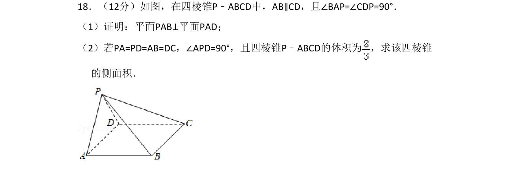
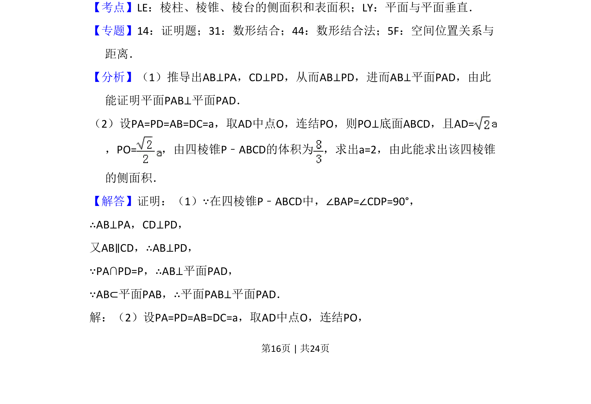
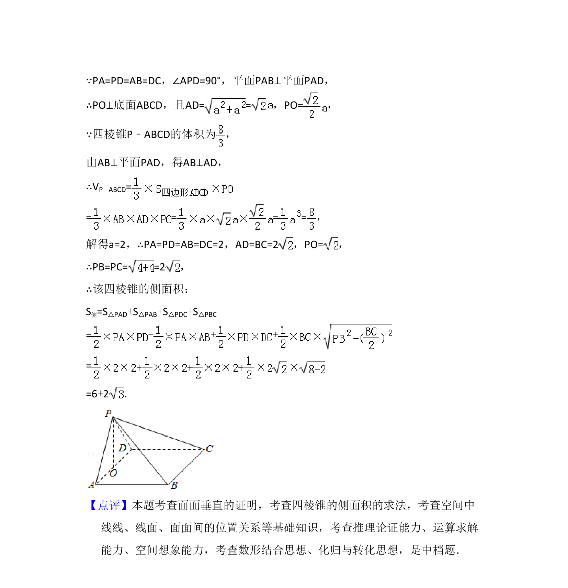

## 题面

## 摘要

该题考查四棱锥中证明面面垂直及已知体积求侧面积。

## 关联考点

- [[1149-面面垂直的判定|平面与平面垂直的判定]]
- [[棱锥的侧面积]]
- [[空间直线与平面位置关系]]

## 答案与解析

> 📄 原 PDF 第 16 页：`素材/真题/湖南/2008-2024·（湖南）数学高考真题/2017年高考数学试卷（文）（新课标Ⅰ）（解析卷）.pdf`
