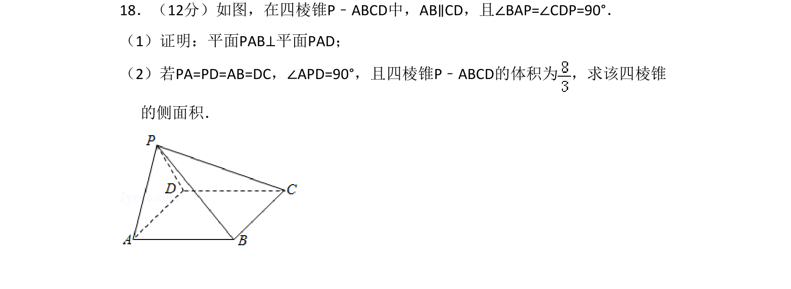
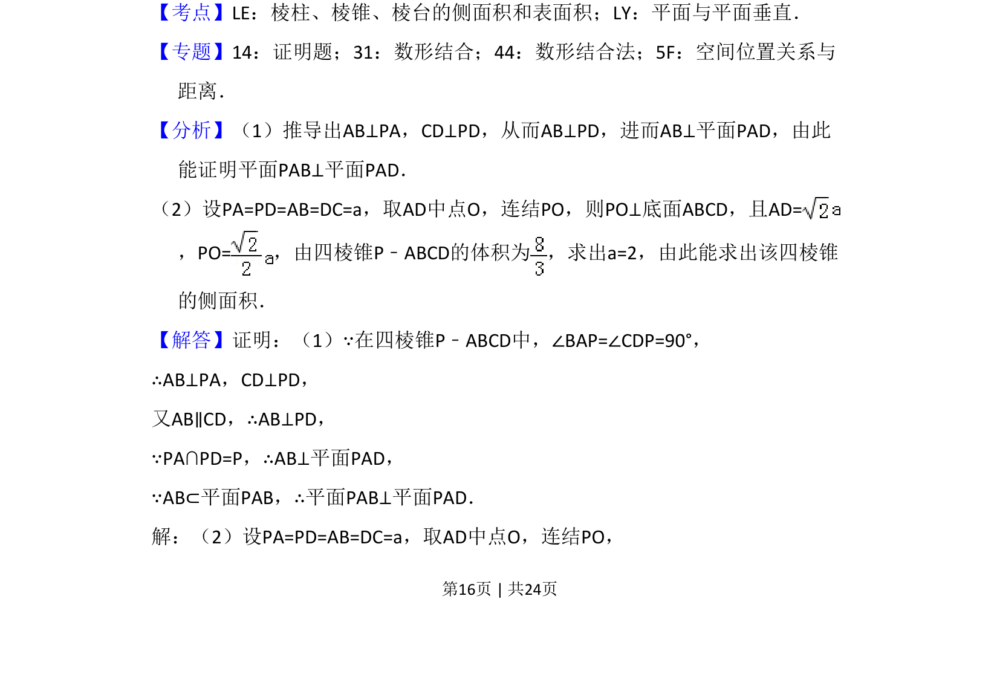
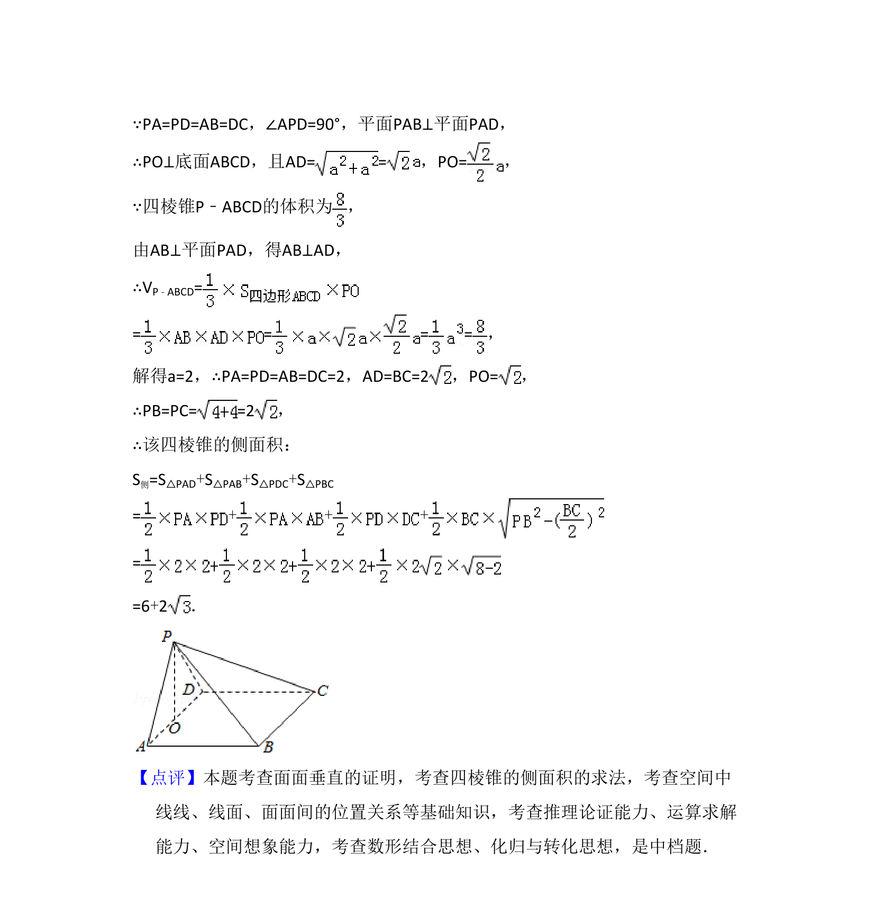

## 题面

## 摘要

该题考查四棱锥中证明面面垂直及已知体积求侧面积。

## 关联考点

- [[1149-面面垂直的判定|平面与平面垂直的判定]]
- [[棱锥的侧面积]]
- [[空间直线与平面位置关系]]

## 答案与解析

> 📄 原 PDF 第 16 页：`素材/真题/湖南/2008-2024·（湖南）数学高考真题/2017年高考数学试卷（文）（新课标Ⅰ）（解析卷）.pdf`

<!-- 题干文本-start -->
## 题干文本
18．（12分）如图，在四棱锥P﹣ABCD中，AB∥CD，且∠BAP=∠CDP=90°．
（1）证明：平面PAB⊥平面PAD；
（2）若PA=PD=AB=DC，∠APD=90°，且四棱锥P﹣ABCD的体积为 ，求该四棱锥
的侧面积．
<!-- 题干文本-end -->

<!-- 解析文本-start -->
## 解析文本
【考点】LE：棱柱、棱锥、棱台的侧面积和表面积；LY：平面与平面垂直．菁优网版权所有
【专题】14：证明题；31：数形结合；44：数形结合法；5F：空间位置关系与
距离．
【分析】（1）推导出AB⊥PA，CD⊥PD，从而AB⊥PD，进而AB⊥平面PAD，由此
能证明平面PAB⊥平面PAD．
（2）设PA=PD=AB=DC=a，取AD中点O，连结PO，则PO⊥底面ABCD，且AD=
，PO=，由四棱锥P﹣ABCD的体积为 ，求出a=2，由此能求出该四棱锥
的侧面积．
【解答】证明：（1）∵在四棱锥P﹣ABCD中，∠BAP=∠CDP=90°，
∴AB⊥PA，CD⊥PD，
又AB∥CD，∴AB⊥PD，
∵PA∩PD=P，∴AB⊥平面PAD，
∵AB⊂平面PAB，∴平面PAB⊥平面PAD．
解：（2）设PA=PD=AB=DC=a，取AD中点O，连结PO，
<!-- 解析文本-end -->
