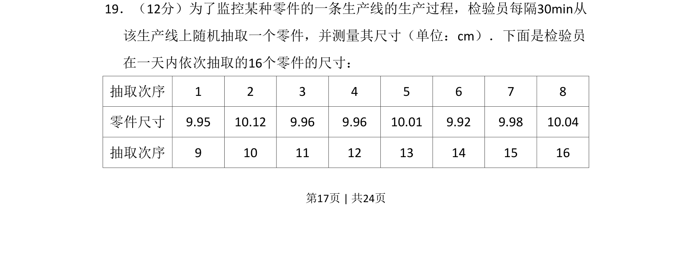
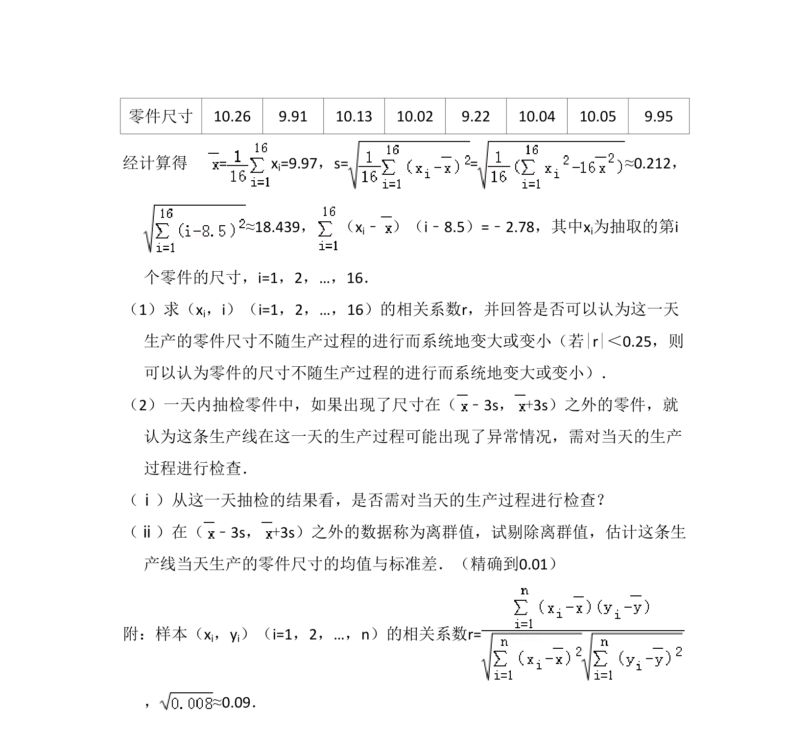
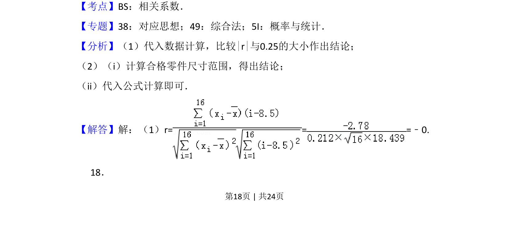
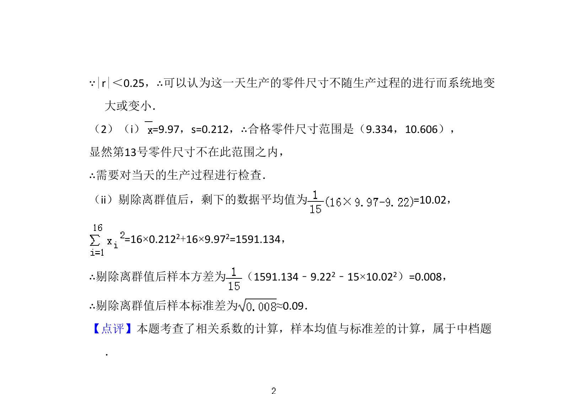

## 题面

## 摘要

统计型应用题，通过生产线上随机抽取零件尺寸的实例考查数据分析与处理能力。

## 关联考点

- [[1346-随机抽样|随机抽样]]
- [[141-统计图|统计图表]]
- [[899-数据分析|数据分析]]

## 答案与解析

> 📄 原 PDF 第 17 页：`素材/真题/湖南/2008-2024·（湖南）数学高考真题/2017年高考数学试卷（文）（新课标Ⅰ）（解析卷）.pdf`
