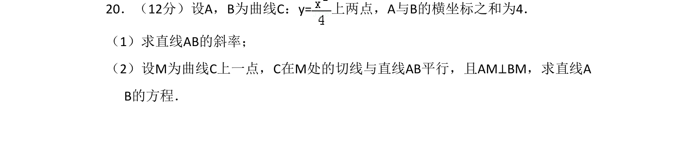
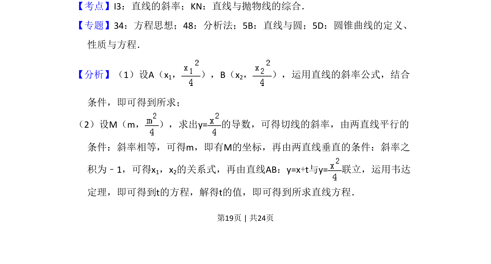
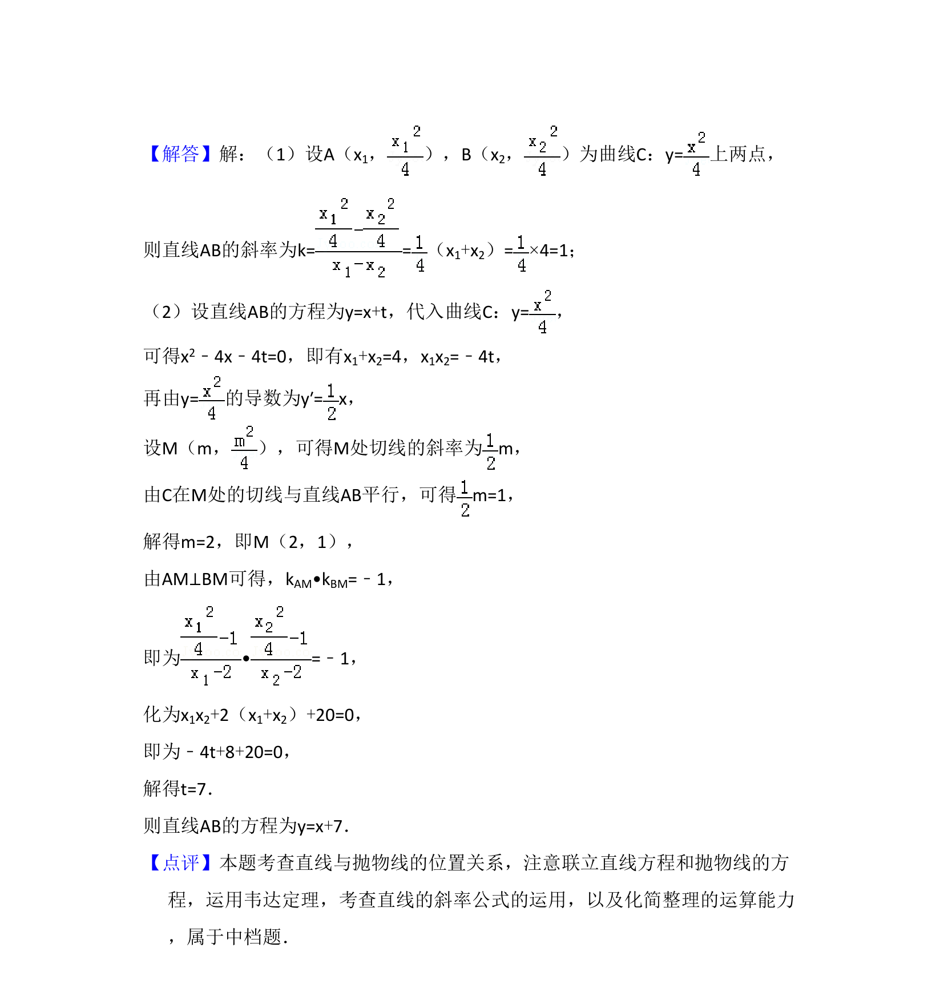

## 题面

## 摘要

本题通过给定抛物线上两点横坐标之和求直线斜率，并利用导数求切线、平行垂直关系建立方程求解直线方程。

## 关联考点

- [[1029-直线的斜率|直线的斜率]]
- [[1018-直线与抛物线的综合|直线与抛物线的综合]]
- [[导数与切线]]
- [[234-韦达定理-初中|韦达定理]]

## 答案与解析

> 📄 原 PDF 第 19 页：`素材/真题/湖南/2008-2024·（湖南）数学高考真题/2017年高考数学试卷（文）（新课标Ⅰ）（解析卷）.pdf`
