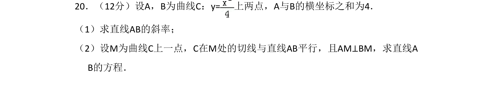
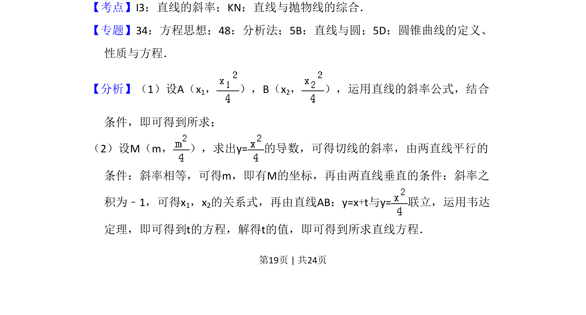
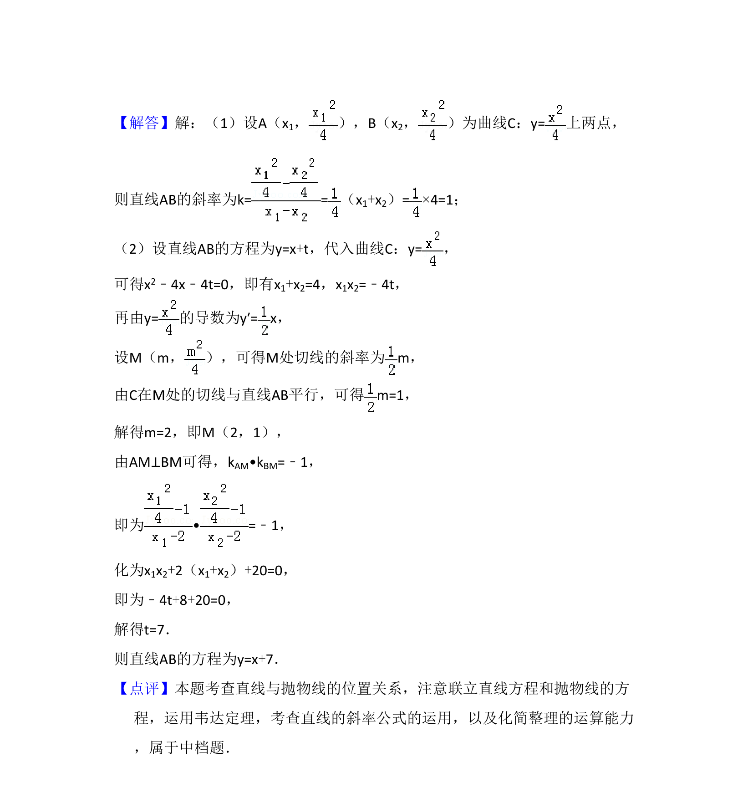

## 题面

## 摘要

本题通过给定抛物线上两点横坐标之和求直线斜率，并利用导数求切线、平行垂直关系建立方程求解直线方程。

## 关联考点

- [[1029-直线的斜率|直线的斜率]]
- [[1018-直线与抛物线的综合|直线与抛物线的综合]]
- [[导数与切线]]
- [[234-韦达定理-初中|韦达定理]]

## 答案与解析

> 📄 原 PDF 第 19 页：`素材/真题/湖南/2008-2024·（湖南）数学高考真题/2017年高考数学试卷（文）（新课标Ⅰ）（解析卷）.pdf`

<!-- 题干文本-start -->
## 题干文本
20．（12分）设A，B为曲线C：y=上两点，A与B的横坐标之和为4．
（1）求直线AB的斜率；
（2）设M为曲线C上一点，C在M处的切线与直线AB平行，且AM⊥BM，求直线A
B的方程．
<!-- 题干文本-end -->

<!-- 解析文本-start -->
## 解析文本
【考点】I3：直线的斜率；KN：直线与抛物线的综合．菁优网版权所有
【专题】34：方程思想；48：分析法；5B：直线与圆；5D：圆锥曲线的定义、
性质与方程．
【分析】（1）设A（x1， ），B（x 2， ），运用直线的斜率公式，结合
条件，即可得到所求；
（2）设M（m， ），求出y=的导数，可得切线的斜率，由两直线平行的
条件：斜率相等，可得m，即有M的坐标，再由两直线垂直的条件：斜率之
积为﹣1，可得x1，x2的关系式，再由直线AB：y=x+t与y=联立，运用韦达
定理，即可得到t的方程，解得t的值，即可得到所求直线方程．
<!-- 解析文本-end -->
