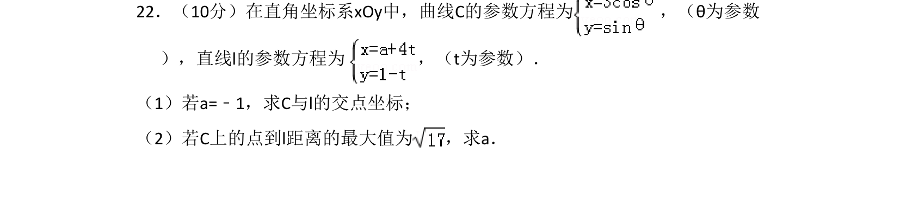
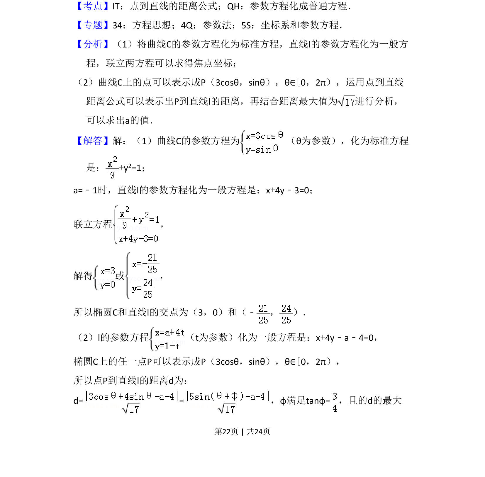
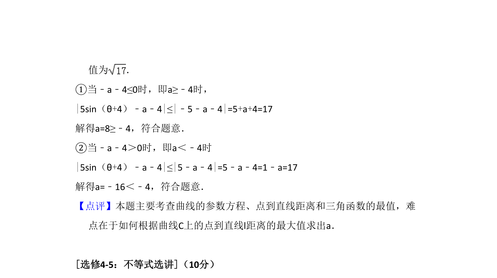

## 题面

## 摘要

考查参数方程与普通方程互化，结合点到直线距离公式求解交点坐标及参数最值。

## 关联考点

- [[1273-参数方程与普通方程互化|参数方程与普通方程互化]]
- [[392-点到直线距离公式|点到直线距离公式]]
- [[607-三角函数最值|三角函数最值]]

## 答案与解析

> 📄 原 PDF 第 22 页：`素材/真题/湖南/2008-2024·（湖南）数学高考真题/2017年高考数学试卷（文）（新课标Ⅰ）（解析卷）.pdf`
