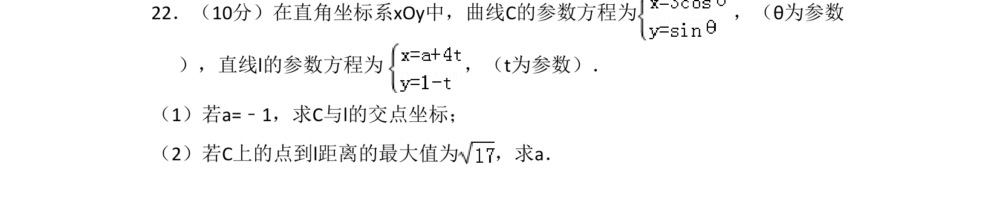
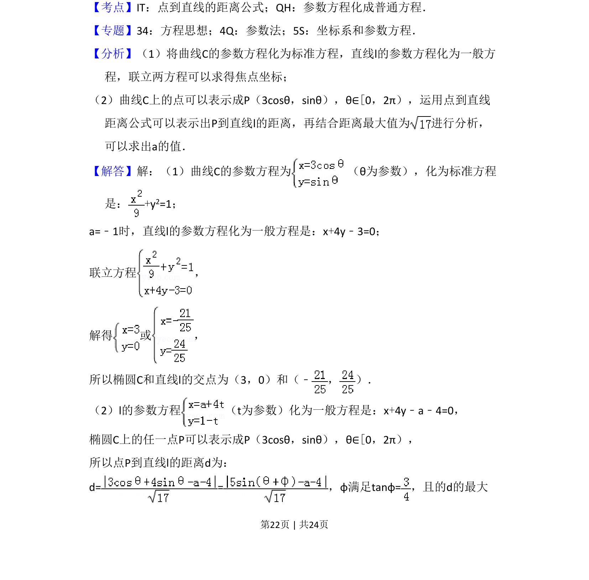
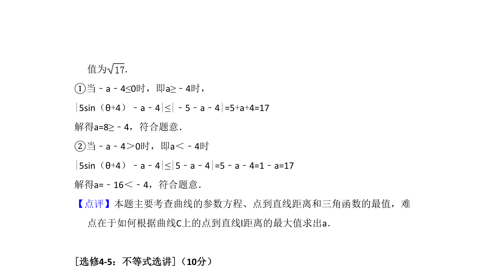

## 题面

## 摘要

考查参数方程与普通方程互化，结合点到直线距离公式求解交点坐标及参数最值。

## 关联考点

- [[1273-参数方程与普通方程互化|参数方程与普通方程互化]]
- [[570-点到直线的距离公式|点到直线距离公式]]
- [[615-三角函数的最值|三角函数最值]]

## 答案与解析

> 📄 原 PDF 第 22 页：`素材/真题/湖南/2008-2024·（湖南）数学高考真题/2017年高考数学试卷（文）（新课标Ⅰ）（解析卷）.pdf`

<!-- 题干文本-start -->
## 题干文本
22．（10分）在直角坐标系xOy中，曲线C的参数方程为 ，（θ为参数
），直线l的参数方程为 ，（t为参数）．
（1）若a=﹣1，求C与l的交点坐标；
（2）若C上的点到l距离的最大值为 ，求a．
<!-- 题干文本-end -->

<!-- 解析文本-start -->
## 解析文本
【考点】IT：点到直线的距离公式；QH：参数方程化成普通方程．菁优网版权所有
【专题】34：方程思想；4Q：参数法；5S：坐标系和参数方程．
【分析】（1）将曲线C的参数方程化为标准方程，直线l的参数方程化为一般方
程，联立两方程可以求得焦点坐标；
（2）曲线C上的点可以表示成P（3cosθ，sinθ），θ∈[0，2π），运用点到直线
距离公式可以表示出P到直线l的距离，再结合距离最大值为 进行分析，
可以求出a的值．
【解答】解：（1）曲线C的参数方程为 （θ为参数），化为标准方程
是：+y 2=1；
a=﹣1时，直线l的参数方程化为一般方程是：x+4y﹣3=0；
联立方程 ，
解得 或 ，
所以椭圆C和直线l的交点为（3，0）和（﹣ ， ）．
（2）l的参数方程 （t为参数）化为一般方程是：x+4y﹣a﹣4=0，
椭圆C上的任一点P可以表示成P（3cosθ，sinθ），θ∈[0，2π），
所以点P到直线l的距离d为：
d= =，φ满足tanφ=，且的d的最大
<!-- 解析文本-end -->
