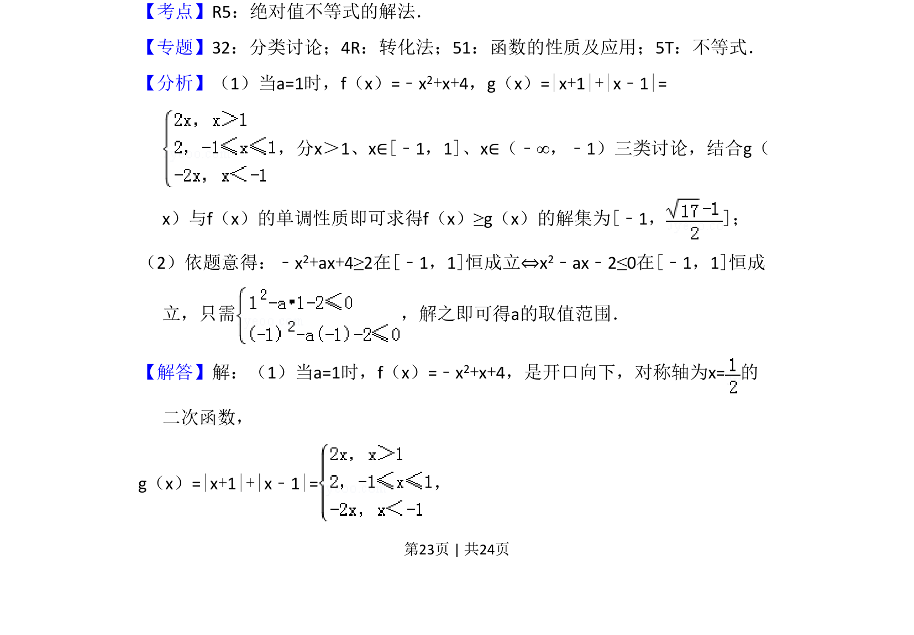
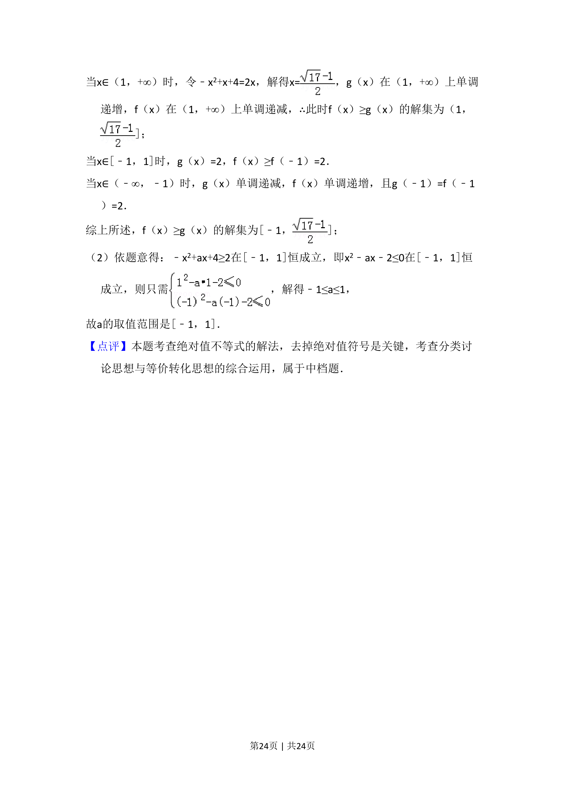

## 题面

## 摘要

本题主要考查含绝对值不等式的解法以及含参二次不等式在给定区间恒成立求参数范围。

## 关联考点

- [[1093-绝对值不等式的解法|绝对值不等式的解法]]
- [[424-参数分类讨论|分类讨论]]
- [[二次不等式恒成立]]
- [[721-参数取值范围|参数取值范围]]

## 答案与解析

> 📄 原 PDF 第 23 页：`素材/真题/湖南/2008-2024·（湖南）数学高考真题/2017年高考数学试卷（文）（新课标Ⅰ）（解析卷）.pdf`
