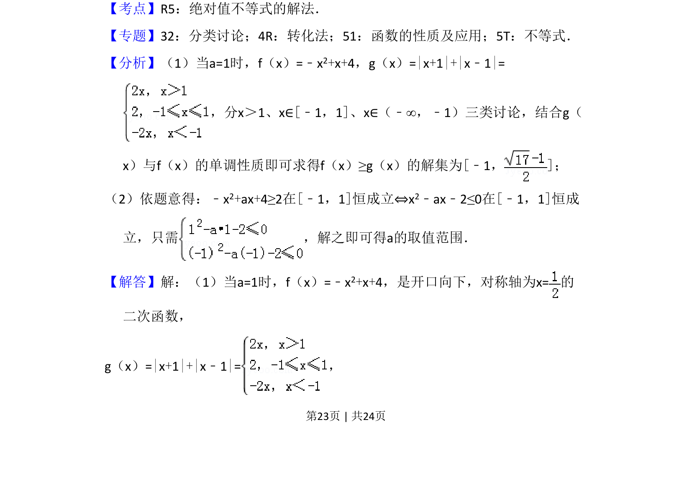
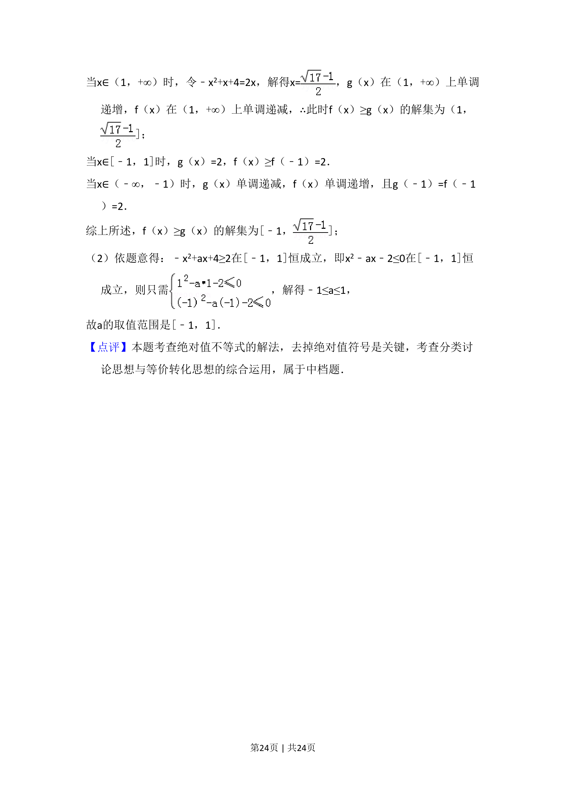

## 题面

## 摘要

本题主要考查含绝对值不等式的解法以及含参二次不等式在给定区间恒成立求参数范围。

## 关联考点

- [[1093-绝对值不等式的解法|绝对值不等式的解法]]
- [[424-参数分类讨论|分类讨论]]
- [[二次不等式恒成立]]
- [[721-参数取值范围|参数取值范围]]

## 答案与解析

> 📄 原 PDF 第 23 页：`素材/真题/湖南/2008-2024·（湖南）数学高考真题/2017年高考数学试卷（文）（新课标Ⅰ）（解析卷）.pdf`

<!-- 题干文本-start -->
## 题干文本
23．已知函数f（x）=﹣x2+ax+4，g（x）=|x+1|+|x﹣1|．
（1）当a=1时，求不等式f（x）≥g（x）的解集；
（2）若不等式f（x）≥g（x）的解集包含[﹣1，1]，求a的取值范围．
<!-- 题干文本-end -->

<!-- 解析文本-start -->
## 解析文本
【考点】R5：绝对值不等式的解法．菁优网版权所有
【专题】32：分类讨论；4R：转化法；51：函数的性质及应用；5T：不等式．
【分析】（1）当a=1时，f（x）=﹣x2+x+4，g（x）=|x+1|+|x﹣1|=
，分x＞1、x∈[﹣1，1]、x∈（﹣∞，﹣1）三类讨论，结合g（
x）与f（x）的单调性质即可求得f（x）≥g（x）的解集为[﹣1，]；
（2）依题意得：﹣x2+ax+4≥2在[﹣1，1]恒成立⇔x2﹣ax﹣2≤0在[﹣1，1]恒成
立，只需 ，解之即可得a的取值范围．
【解答】解：（1）当a=1时，f（x）=﹣x2+x+4，是开口向下，对称轴为x=的
二次函数，
g（x）=|x+1|+|x﹣1|=，
<!-- 解析文本-end -->
