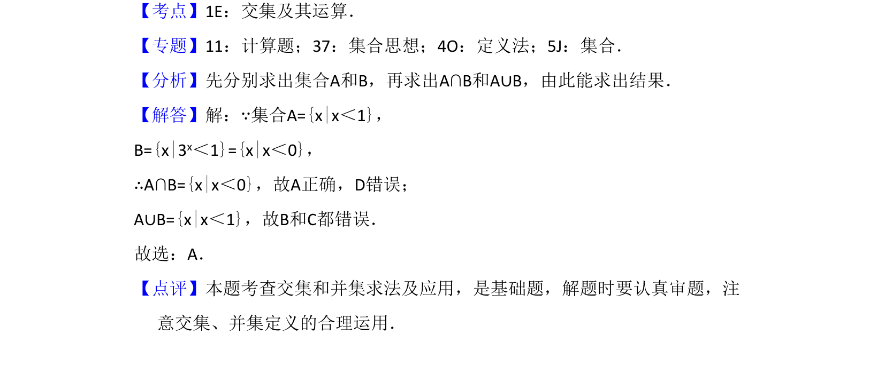

## 题面

## 摘要

考查集合的简单不等式求解及交集与并集运算。

## 关联考点

- [[集合的表示与化简]]
- [[646-交集运算|交集运算]]
- [[860-并集运算|并集运算]]

## 答案与解析

> 📄 原 PDF 第 1 页：`素材/真题/湖南/2008-2024·（湖南）数学高考真题/2017年高考数学试卷（理）（新课标Ⅰ）（解析卷）.pdf`

<!-- 题干文本-start -->
## 题干文本
1．（5分）已知集合A={x|x＜1}，B={x|3x＜1}，则（　　）
A．A∩B={x|x＜0}B．A∪B=R C．A∪B={x|x＞1}D．A∩B=∅
<!-- 题干文本-end -->

<!-- 解析文本-start -->
## 解析文本
【考点】1E：交集及其运算．菁优网版权所有
【专题】11：计算题；37：集合思想；4O：定义法；5J：集合．
【分析】先分别求出集合A和B，再求出A∩B和A∪B，由此能求出结果．
【解答】解：∵集合A={x|x＜1}，
B={x|3x＜1}={x|x＜0}，
∴A∩B={x|x＜0}，故A正确，D错误；
A∪B={x|x＜1}，故B和C都错误．
故选：A．
【点评】本题考查交集和并集求法及应用，是基础题，解题时要认真审题，注
意交集、并集定义的合理运用．
<!-- 解析文本-end -->
