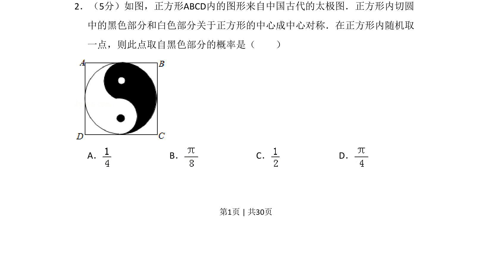
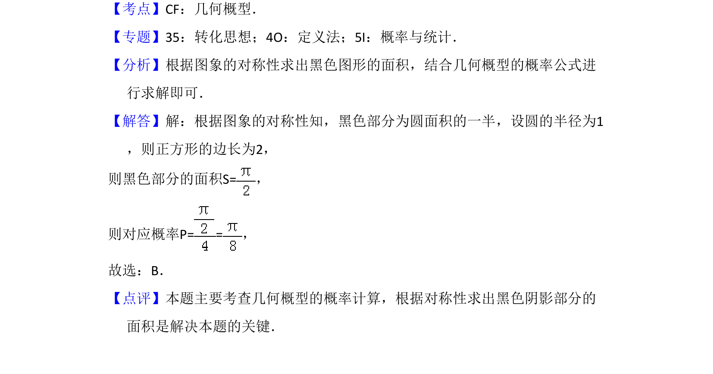

## 题面

## 摘要

本题考查几何概型，利用对称性计算黑色部分面积占比求概率。

## 关联考点

- [[667-几何概型|几何概型]]
- [[834-对称性|对称性]]
- [[1146-面积计算|面积计算]]

## 答案与解析

> 📄 原 PDF 第 1 页：`素材/真题/湖南/2008-2024·（湖南）数学高考真题/2017年高考数学试卷（理）（新课标Ⅰ）（解析卷）.pdf`
