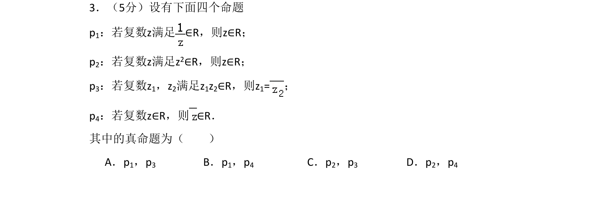
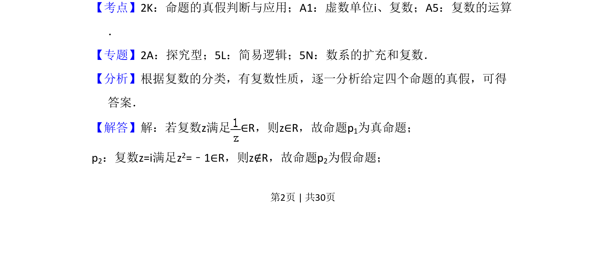
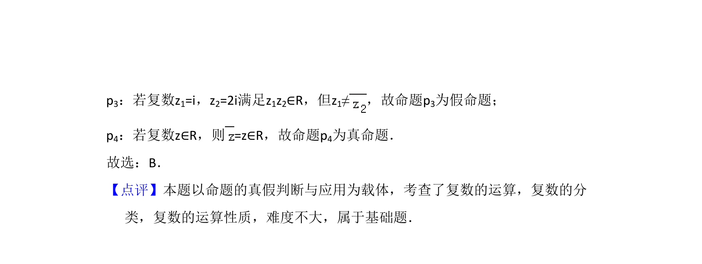

## 题面

## 摘要

考查复数相关命题的真假判断，涉及复数分类与运算性质

## 关联考点

- [[764-命题的真假判断与应用|命题的真假判断与应用]]
- [[330-复数概念|复数]]
- [[808-复数的运算|复数的运算]]

## 答案与解析

> 📄 原 PDF 第 2 页：`素材/真题/湖南/2008-2024·（湖南）数学高考真题/2017年高考数学试卷（理）（新课标Ⅰ）（解析卷）.pdf`
