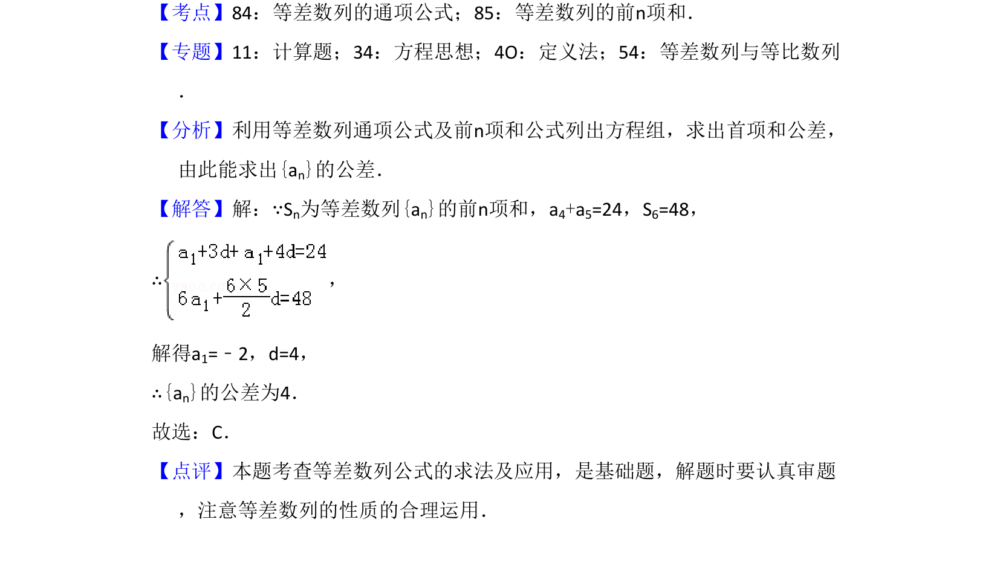

## 题面

## 摘要

利用等差数列通项公式及前n项和公式列方程组，求公差。

## 关联考点

- [[1063-等差数列通项公式|等差数列通项公式]]
- [[355-等差数列前n项和|等差数列前n项和]]
- [[方程组求解]]

## 答案与解析

> 📄 原 PDF 第 3 页：`素材/真题/湖南/2008-2024·（湖南）数学高考真题/2017年高考数学试卷（理）（新课标Ⅰ）（解析卷）.pdf`
