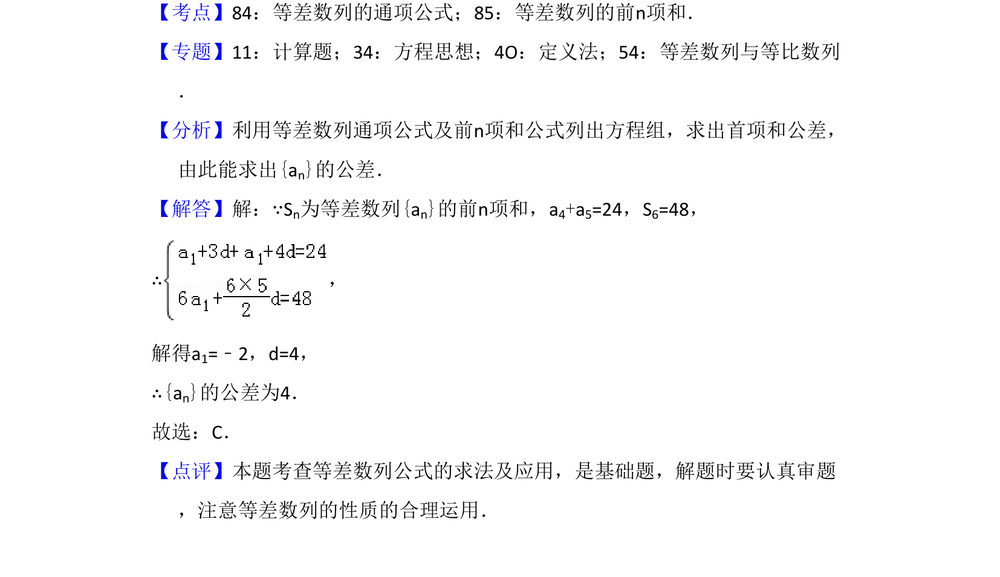

## 题面

## 摘要

利用等差数列通项公式及前n项和公式列方程组，求公差。

## 关联考点

- [[1063-等差数列通项公式|等差数列通项公式]]
- [[355-等差数列前n项和|等差数列前n项和]]
- [[方程组求解]]

## 答案与解析

> 📄 原 PDF 第 3 页：`素材/真题/湖南/2008-2024·（湖南）数学高考真题/2017年高考数学试卷（理）（新课标Ⅰ）（解析卷）.pdf`

<!-- 题干文本-start -->
## 题干文本
4．（5分）记Sn为等差数列{an}的前n项和．若a4+a5=24，S6=48，则{an}的公差
为（　　）
A．1 B．2 C．4 D．8
<!-- 题干文本-end -->

<!-- 解析文本-start -->
## 解析文本
【考点】84：等差数列的通项公式；85：等差数列的前n项和．菁优网版权所有
【专题】11：计算题；34：方程思想；4O：定义法；54：等差数列与等比数列
．
【分析】利用等差数列通项公式及前n项和公式列出方程组，求出首项和公差，
由此能求出{an}的公差．
【解答】解：∵Sn为等差数列{an}的前n项和，a4+a5=24，S6=48，
∴，
解得a1=﹣2，d=4，
∴{an}的公差为4．
故选：C．
【点评】本题考查等差数列公式的求法及应用，是基础题，解题时要认真审题
，注意等差数列的性质的合理运用．
<!-- 解析文本-end -->
