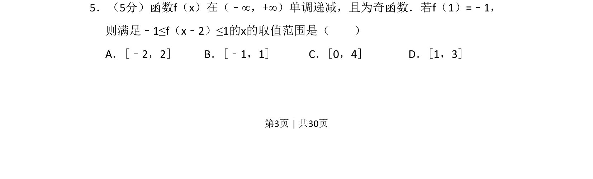
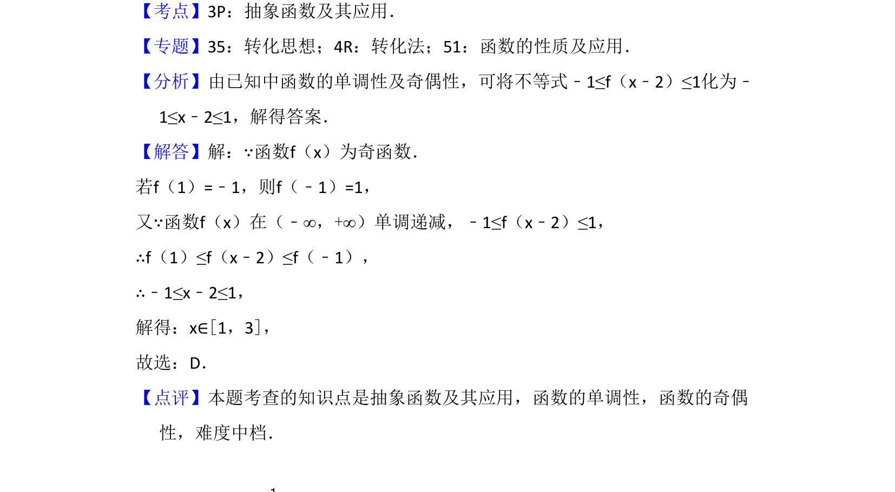

## 题面

## 摘要

函数 f(x) 为奇函数且在 R 上单调递减，利用性质解抽象不等式求 x 范围。

## 关联考点

- [[282-函数的单调性|函数的单调性]]
- [[284-函数的奇偶性|函数的奇偶性]]
- [[552-抽象不等式|抽象不等式]]

## 答案与解析

> 📄 原 PDF 第 3 页：`素材/真题/湖南/2008-2024·（湖南）数学高考真题/2017年高考数学试卷（理）（新课标Ⅰ）（解析卷）.pdf`
