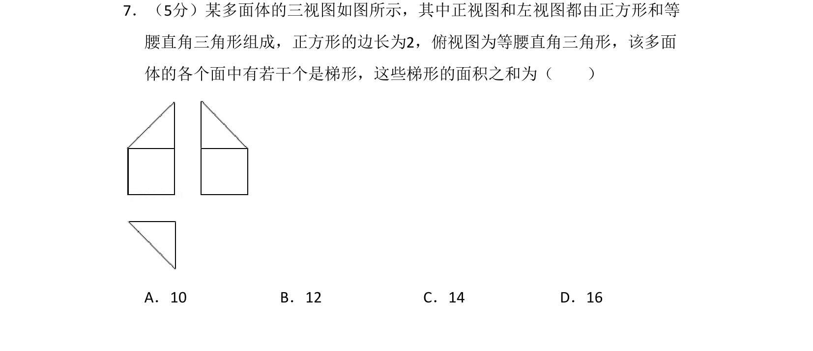
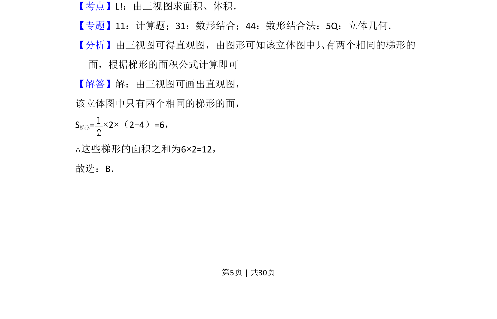
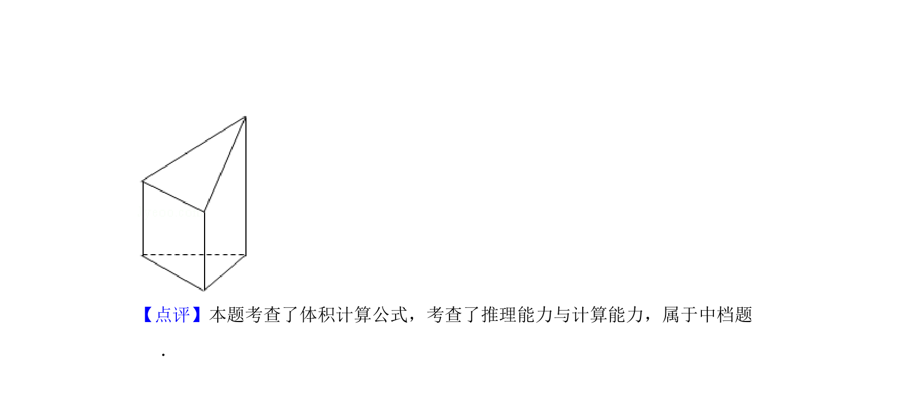

## 题面

## 摘要

由三视图还原多面体直观图，计算其中两个梯形的面积之和。

## 关联考点

- [[235-三视图|三视图]]
- [[直观图还原]]
- [[梯形面积计算]]

## 答案与解析

> 📄 原 PDF 第 5 页：`素材/真题/湖南/2008-2024·（湖南）数学高考真题/2017年高考数学试卷（理）（新课标Ⅰ）（解析卷）.pdf`

<!-- 题干文本-start -->
## 题干文本
7．（5分）某多面体的三视图如图所示，其中正视图和左视图都由正方形和等
腰直角三角形组成，正方形的边长为2，俯视图为等腰直角三角形，该多面
体的各个面中有若干个是梯形，这些梯形的面积之和为（　　）
A．10 B．12 C．14 D．16
<!-- 题干文本-end -->

<!-- 解析文本-start -->
## 解析文本
【考点】L!：由三视图求面积、体积．菁优网版权所有
【专题】11：计算题；31：数形结合；44：数形结合法；5Q：立体几何．
【分析】由三视图可得直观图，由图形可知该立体图中只有两个相同的梯形的
面，根据梯形的面积公式计算即可
【解答】解：由三视图可画出直观图，
该立体图中只有两个相同的梯形的面，
S梯形=×2×（2+4）=6，
∴这些梯形的面积之和为6×2=12，
故选：B．
<!-- 解析文本-end -->
