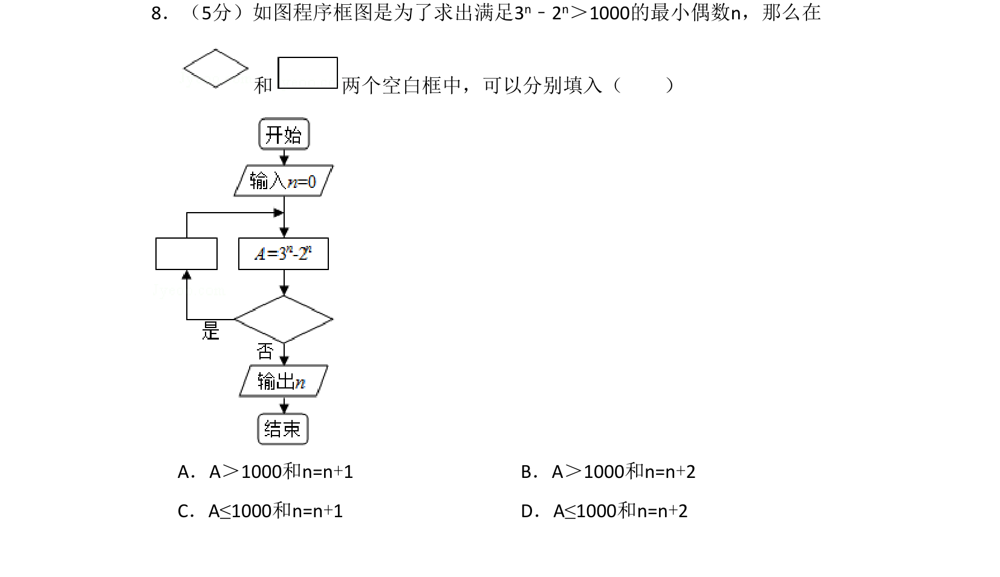
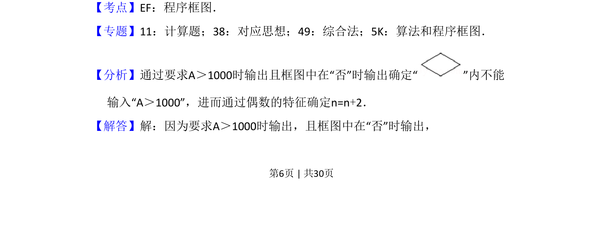
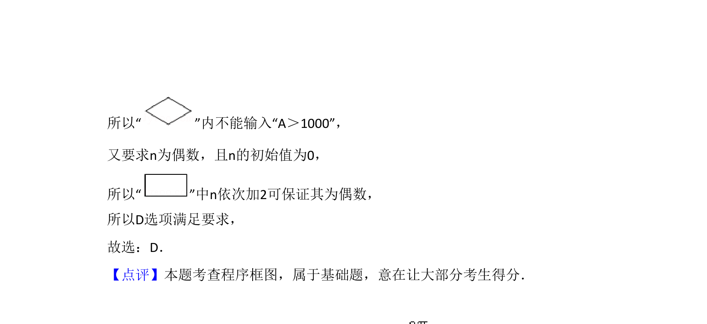

## 题面

## 摘要

考查程序框图中循环结构与条件判断，要求补全判断条件与循环变量增量以输出满足不等式的最小偶数。

## 关联考点

- [[1042-程序框图|程序框图]]
- [[870-循环结构|循环结构]]
- [[916-条件判断|条件判断]]
- [[525-奇数与偶数|偶数]]

## 答案与解析

> 📄 原 PDF 第 6 页：`素材/真题/湖南/2008-2024·（湖南）数学高考真题/2017年高考数学试卷（理）（新课标Ⅰ）（解析卷）.pdf`
