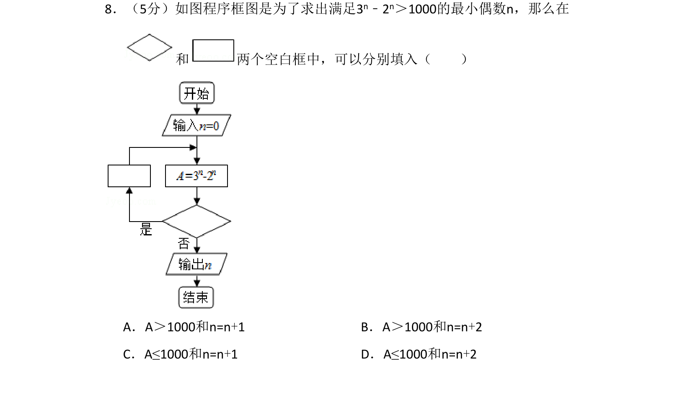
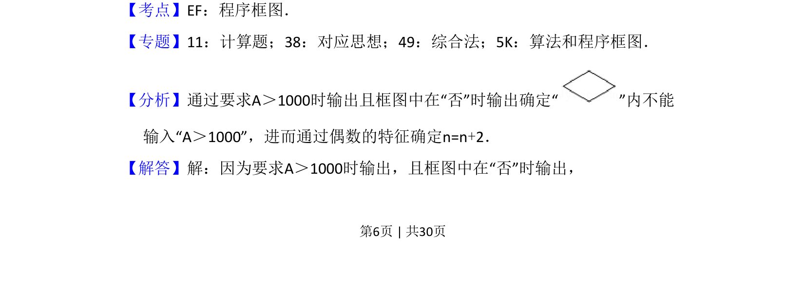
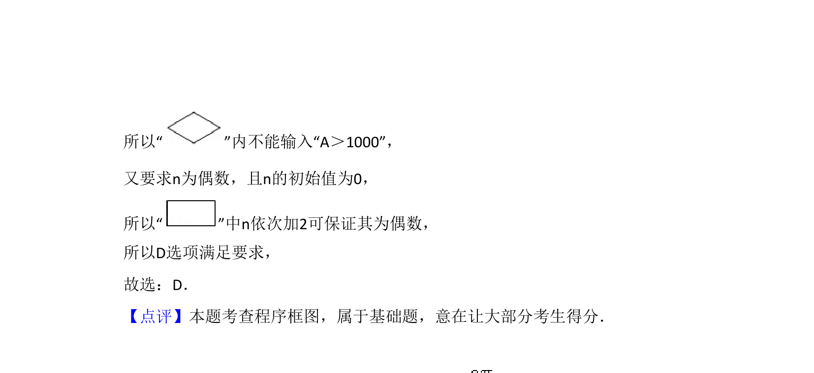

## 题面

## 摘要

考查程序框图中循环结构与条件判断，要求补全判断条件与循环变量增量以输出满足不等式的最小偶数。

## 关联考点

- [[1042-程序框图|程序框图]]
- [[870-循环结构|循环结构]]
- [[916-条件判断|条件判断]]
- [[525-奇数与偶数|偶数]]

## 答案与解析

> 📄 原 PDF 第 6 页：`素材/真题/湖南/2008-2024·（湖南）数学高考真题/2017年高考数学试卷（理）（新课标Ⅰ）（解析卷）.pdf`

<!-- 题干文本-start -->
## 题干文本
8．（5分）如图程序框图是为了求出满足3n﹣2n＞1000的最小偶数n，那么在
和 两个空白框中，可以分别填入（　　）
A．A＞1000和n=n+1 B．A＞1000和n=n+2
C．A≤1000和n=n+1 D．A≤1000和n=n+2
<!-- 题干文本-end -->

<!-- 解析文本-start -->
## 解析文本
【考点】EF：程序框图．菁优网版权所有
【专题】11：计算题；38：对应思想；49：综合法；5K：算法和程序框图．
【分析】通过要求A＞1000时输出且框图中在“否”时输出确定“ ”内不能
输入“A＞1000”，进而通过偶数的特征确定n=n+2．
【解答】解：因为要求A＞1000时输出，且框图中在“否”时输出，
<!-- 解析文本-end -->
