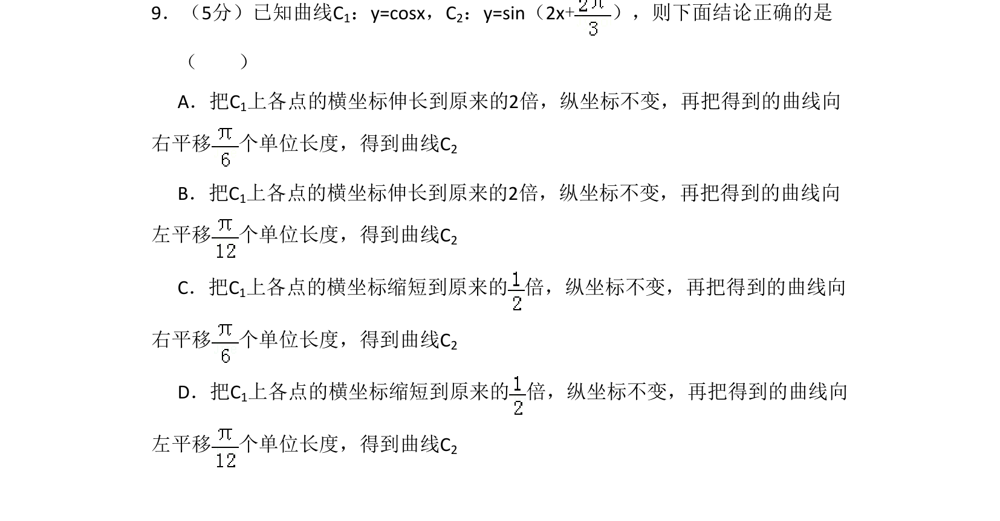
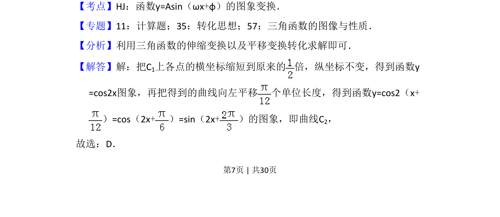

## 题面

## 摘要

考查三角函数图象的伸缩与平移变换，通过变换由y=cosx得到正弦型曲线。

## 关联考点

- [[673-函数y=Asin(ωx+φ)的图象变换|函数y=Asin(ωx+φ)的图象变换]]
- [[三角函数图象的伸缩变换]]
- [[三角函数图象的平移变换]]

## 答案与解析

> 📄 原 PDF 第 7 页：`素材/真题/湖南/2008-2024·（湖南）数学高考真题/2017年高考数学试卷（理）（新课标Ⅰ）（解析卷）.pdf`
