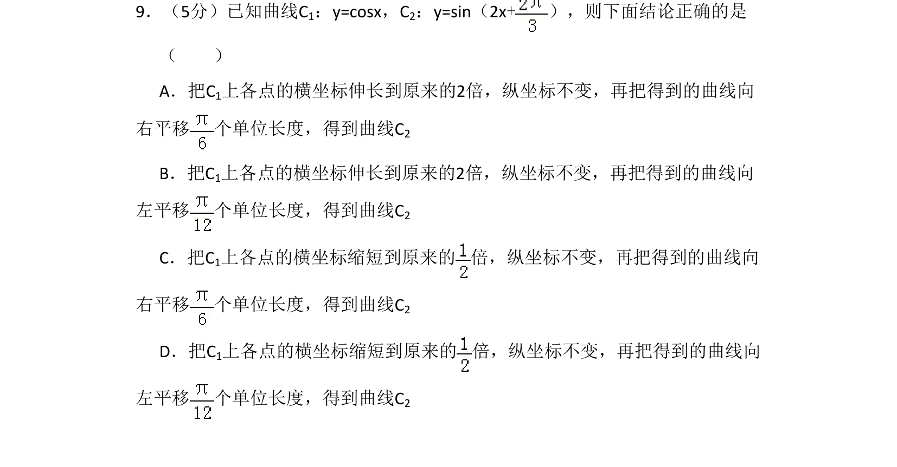
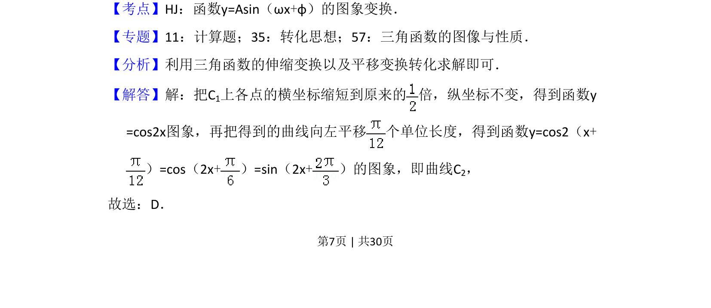

## 题面

## 摘要

考查三角函数图象的伸缩与平移变换，通过变换由y=cosx得到正弦型曲线。

## 关联考点

- [[673-函数y=Asin(ωx+φ)的图象变换|函数y=Asin(ωx+φ)的图象变换]]
- [[三角函数图象的伸缩变换]]
- [[三角函数图象的平移变换]]

## 答案与解析

> 📄 原 PDF 第 7 页：`素材/真题/湖南/2008-2024·（湖南）数学高考真题/2017年高考数学试卷（理）（新课标Ⅰ）（解析卷）.pdf`

<!-- 题干文本-start -->
## 题干文本
9．（5分）已知曲线C1：y=cosx，C2：y=sin（2x+），则下面结论正确的是
（　　）
A．把C1上各点的横坐标伸长到原来的2倍，纵坐标不变，再把得到的曲线向
右平移 个单位长度，得到曲线C 2
B．把C1上各点的横坐标伸长到原来的2倍，纵坐标不变，再把得到的曲线向
左平移 个单位长度，得到曲线C 2
C．把C1上各点的横坐标缩短到原来的 倍，纵坐标不变，再把得到的曲线向
右平移 个单位长度，得到曲线C 2
D．把C1上各点的横坐标缩短到原来的 倍，纵坐标不变，再把得到的曲线向
左平移 个单位长度，得到曲线C 2
<!-- 题干文本-end -->

<!-- 解析文本-start -->
## 解析文本
【考点】HJ：函数y=Asin（ωx+φ）的图象变换．菁优网版权所有
【专题】11：计算题；35：转化思想；57：三角函数的图像与性质．
【分析】利用三角函数的伸缩变换以及平移变换转化求解即可．
【解答】解：把C1上各点的横坐标缩短到原来的 倍，纵坐标不变，得到函数y
=cos2x图象，再把得到的曲线向左平移 个单位长度，得到函数y=cos2（x+
）=cos（2x+）=sin（2x+）的图象，即曲线C 2，
故选：D．
<!-- 解析文本-end -->
