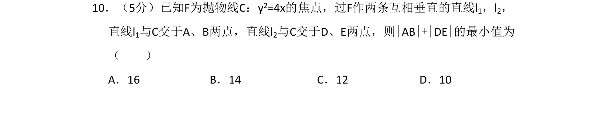
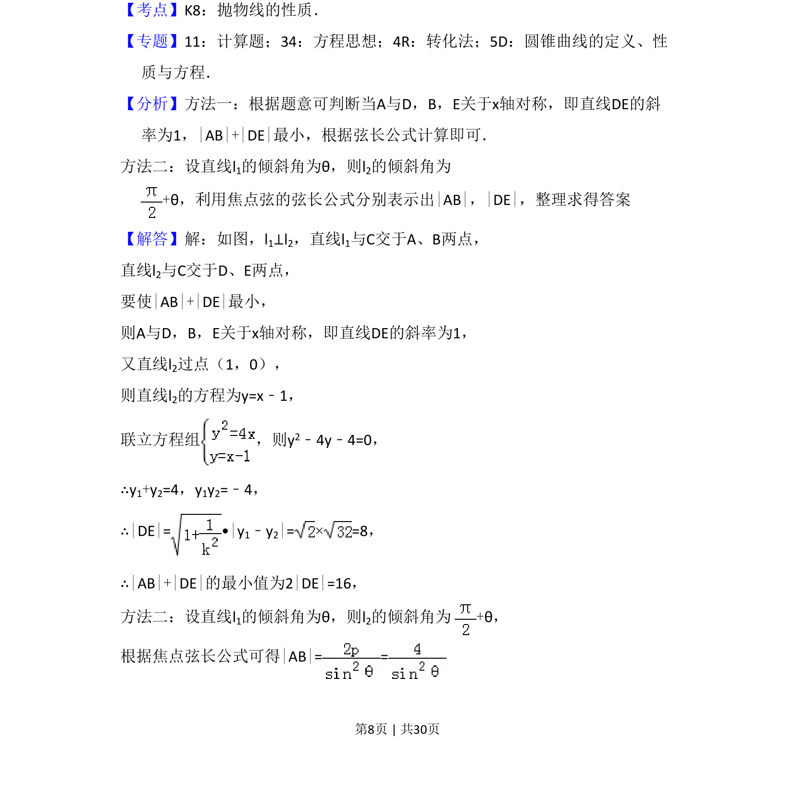
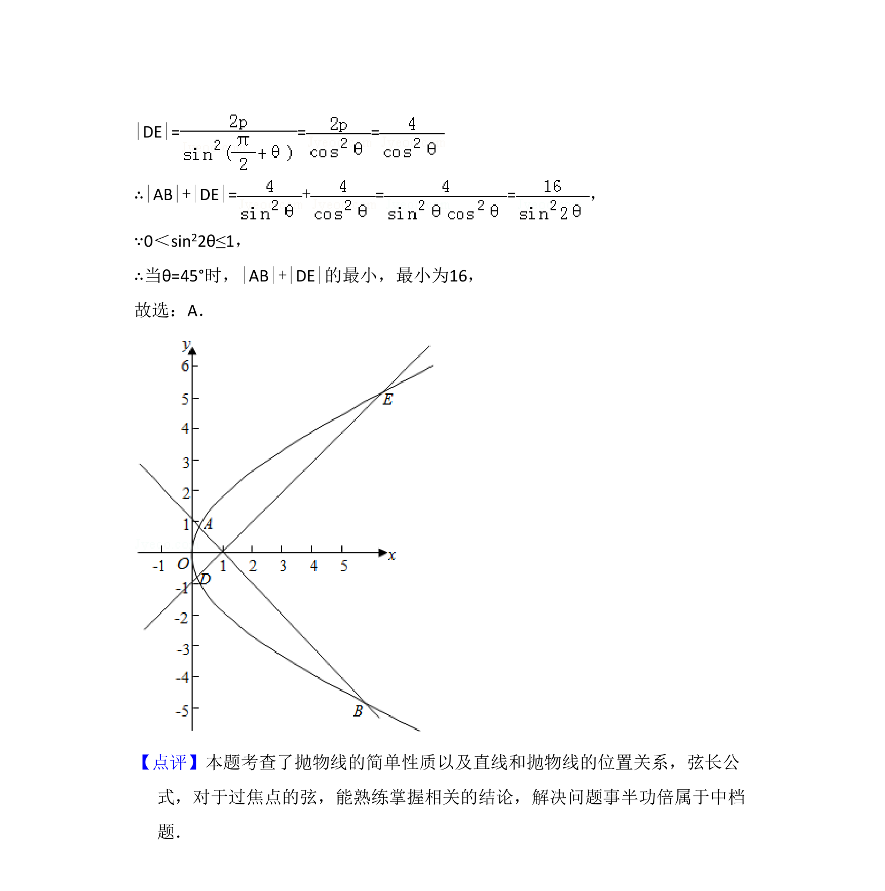

## 题面

## 摘要

该题考查抛物线的焦点弦性质及两垂直弦长之和的最小值求法，涉及焦点弦公式与最值分析。

## 关联考点

- [[879-抛物线的性质|抛物线的性质]]
- [[380-抛物线焦点弦|焦点弦]]
- [[867-弦长公式|弦长公式]]
- [[286-函数的最值|最值]]

## 答案与解析

> 📄 原 PDF 第 8 页：`素材/真题/湖南/2008-2024·（湖南）数学高考真题/2017年高考数学试卷（理）（新课标Ⅰ）（解析卷）.pdf`
