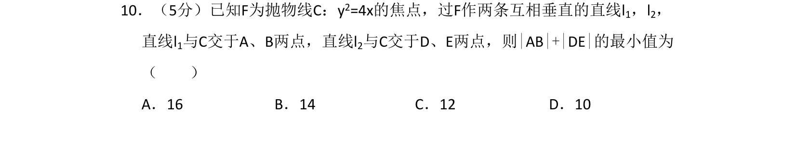
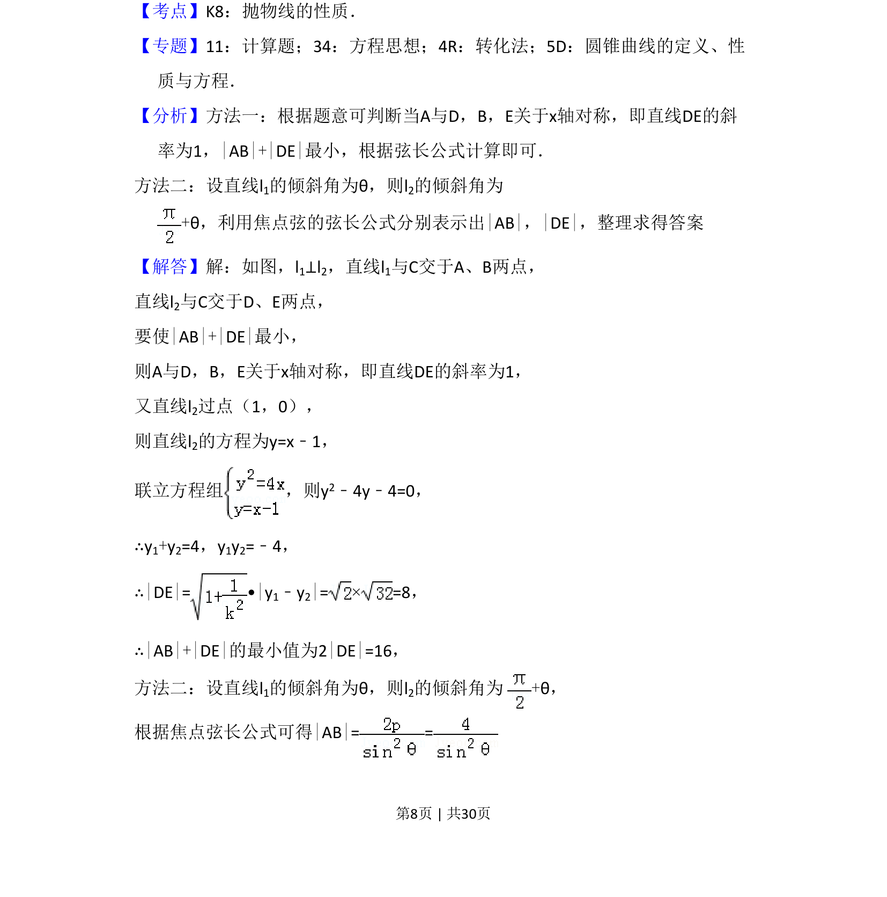
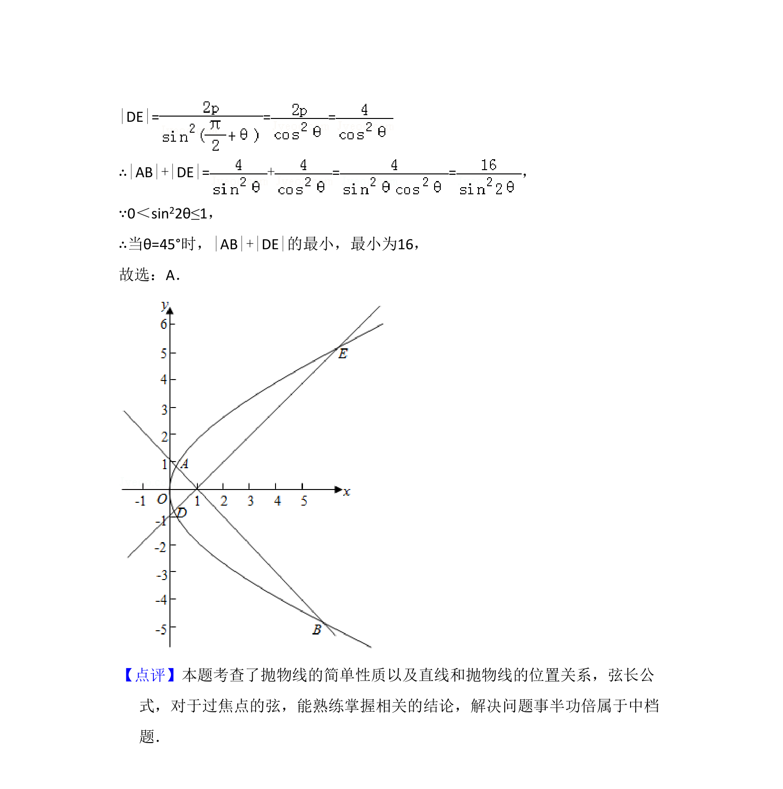

## 题面

## 摘要

该题考查抛物线的焦点弦性质及两垂直弦长之和的最小值求法，涉及焦点弦公式与最值分析。

## 关联考点

- [[879-抛物线的性质|抛物线的性质]]
- [[380-抛物线焦点弦|焦点弦]]
- [[867-弦长公式|弦长公式]]
- [[286-函数的最值|最值]]

## 答案与解析

> 📄 原 PDF 第 8 页：`素材/真题/湖南/2008-2024·（湖南）数学高考真题/2017年高考数学试卷（理）（新课标Ⅰ）（解析卷）.pdf`

<!-- 题干文本-start -->
## 题干文本
10．（5分）已知F为抛物线C：y2=4x的焦点，过F作两条互相垂直的直线l1，l2，
直线l1与C交于A、B两点，直线l2与C交于D、E两点，则|AB|+|DE|的最小值为
（　　）
A．16 B．14 C．12 D．10
<!-- 题干文本-end -->

<!-- 解析文本-start -->
## 解析文本
【考点】K8：抛物线的性质．菁优网版权所有
【专题】11：计算题；34：方程思想；4R：转化法；5D：圆锥曲线的定义、性
质与方程．
【分析】方法一：根据题意可判断当A与D，B，E关于x轴对称，即直线DE的斜
率为1，|AB|+|DE|最小，根据弦长公式计算即可．
方法二：设直线l1的倾斜角为θ，则l2的倾斜角为 
+θ，利用焦点弦的弦长公式分别表示出|AB|，|DE|，整理求得答案
【解答】解：如图，l1⊥l2，直线l1与C交于A、B两点，
直线l2与C交于D、E两点，
要使|AB|+|DE|最小，
则A与D，B，E关于x轴对称，即直线DE的斜率为1，
又直线l2过点（1，0），
则直线l2的方程为y=x﹣1，
联立方程组 ，则y 2﹣4y﹣4=0，
∴y1+y2=4，y1y2=﹣4，
∴|DE|= •|y 1﹣y2|=×=8，
∴|AB|+|DE|的最小值为2|DE|=16，
方法二：设直线l1的倾斜角为θ，则l2的倾斜角为 +θ，
根据焦点弦长公式可得|AB|= =
<!-- 解析文本-end -->
