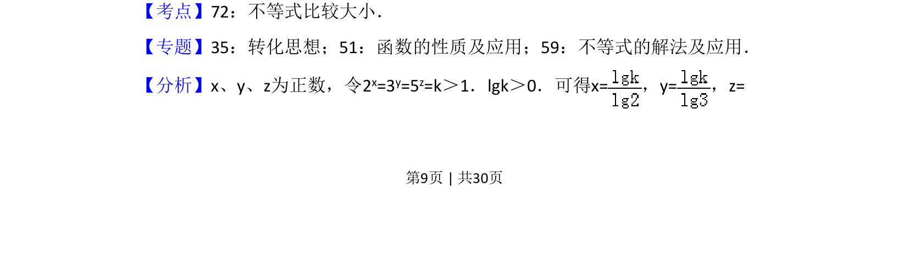
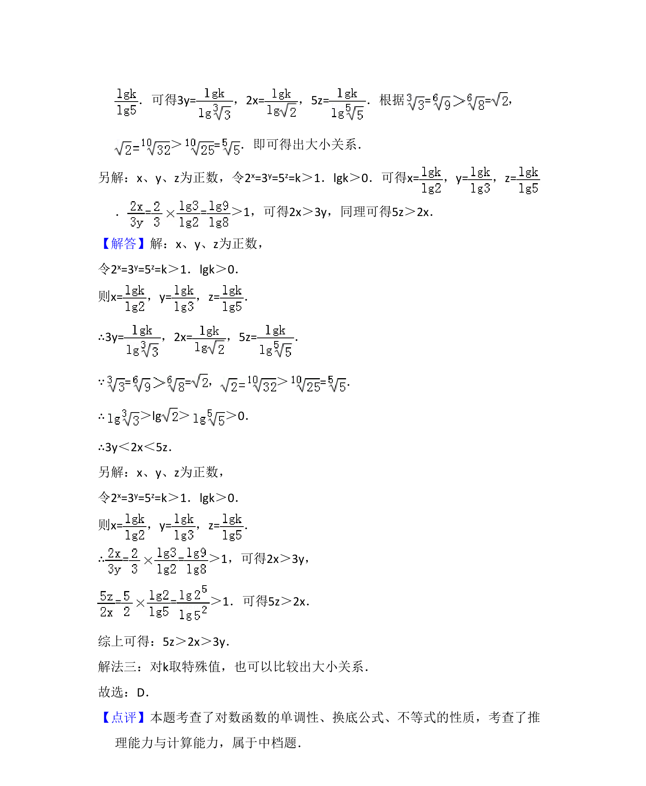

## 题面

## 摘要

令2^x=3^y=5^z=k，借助对数表示变量并利用函数单调性比较大小。

## 关联考点

- [[889-数值比较|不等式比较大小]]
- [[832-对数运算|对数运算]]
- [[304-指数函数|指数函数]]

## 答案与解析

> 📄 原 PDF 第 9 页：`素材/真题/湖南/2008-2024·（湖南）数学高考真题/2017年高考数学试卷（理）（新课标Ⅰ）（解析卷）.pdf`
