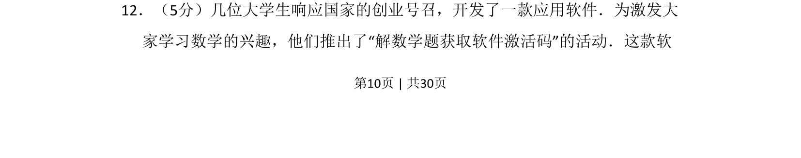
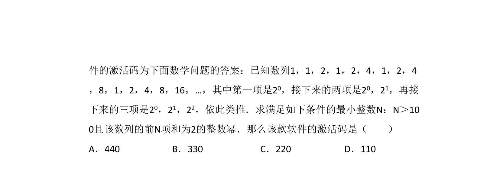
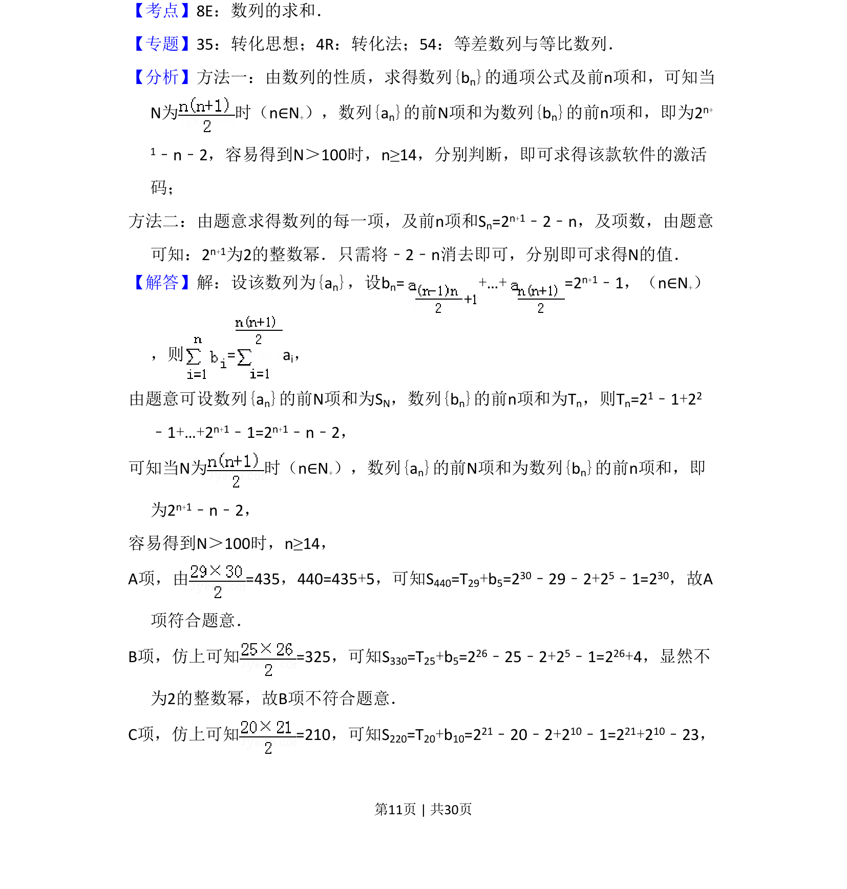
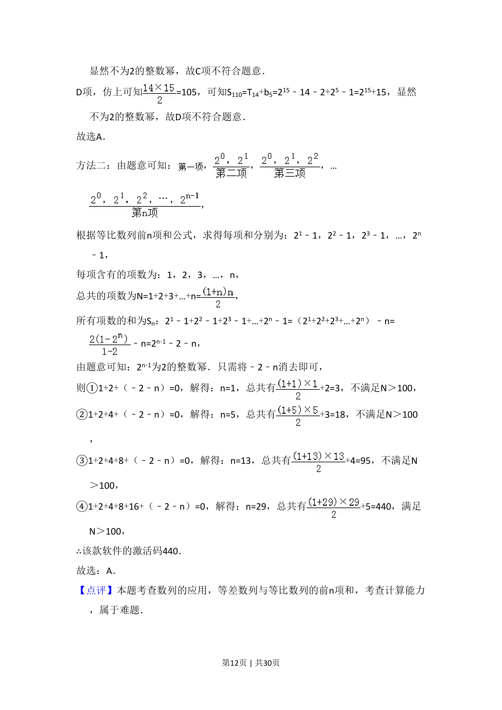
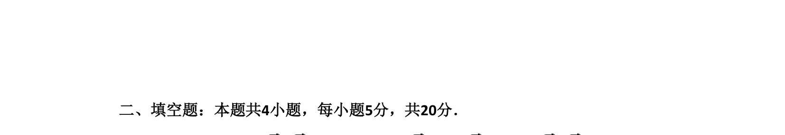

## 题面

## 摘要

以软件激活码为背景，考查数列与不等式综合应用

## 关联考点

- [[381-数列概念-高中|数列]]
- [[083-不等式|不等式]]
- [[037-推理|逻辑推理]]

## 答案与解析

> 📄 原 PDF 第 10 页：`素材/真题/湖南/2008-2024·（湖南）数学高考真题/2017年高考数学试卷（理）（新课标Ⅰ）（解析卷）.pdf`
