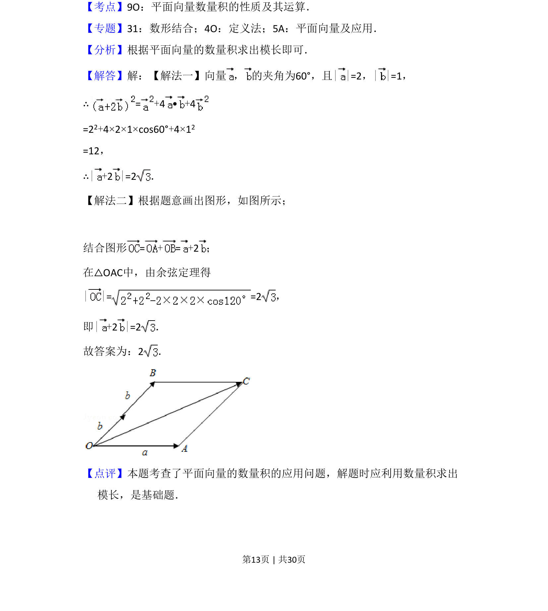

## 题面

## 摘要

已知向量夹角与模长，利用数量积运算求向量和的模。

## 关联考点

- [[854-平面向量数量积|平面向量数量积]]
- [[752-向量模长|向量模长]]
- [[324-向量的夹角|向量夹角]]

## 答案与解析

> 📄 原 PDF 第 13 页：`素材/真题/湖南/2008-2024·（湖南）数学高考真题/2017年高考数学试卷（理）（新课标Ⅰ）（解析卷）.pdf`
