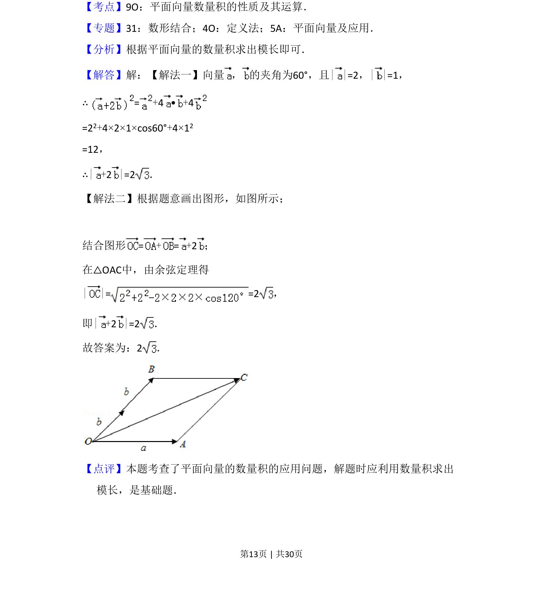

## 题面

## 摘要

已知向量夹角与模长，利用数量积运算求向量和的模。

## 关联考点

- [[854-平面向量数量积|平面向量数量积]]
- [[752-向量模长|向量模长]]
- [[324-向量的夹角|向量夹角]]

## 答案与解析

> 📄 原 PDF 第 13 页：`素材/真题/湖南/2008-2024·（湖南）数学高考真题/2017年高考数学试卷（理）（新课标Ⅰ）（解析卷）.pdf`

<!-- 题干文本-start -->
## 题干文本
13．（5分）已知向量 ， 的夹角为60°，| |=2，| |=1，则| +2|=　2 　
．
<!-- 题干文本-end -->

<!-- 解析文本-start -->
## 解析文本
【考点】9O：平面向量数量积的性质及其运算．菁优网版权所有
【专题】31：数形结合；4O：定义法；5A：平面向量及应用．
【分析】根据平面向量的数量积求出模长即可．
【解答】解：【解法一】向量 ， 的夹角为60°，且| |=2，| |=1，
∴=+4 •+4
=22+4×2×1×cos60°+4×12
=12，
∴| +2|=2．
【解法二】根据题意画出图形，如图所示；
结合图形=+=+2；
在△OAC中，由余弦定理得
| |= =2，
即| +2|=2．
故答案为：2．
【点评】本题考查了平面向量的数量积的应用问题，解题时应利用数量积求出
模长，是基础题．
<!-- 解析文本-end -->
