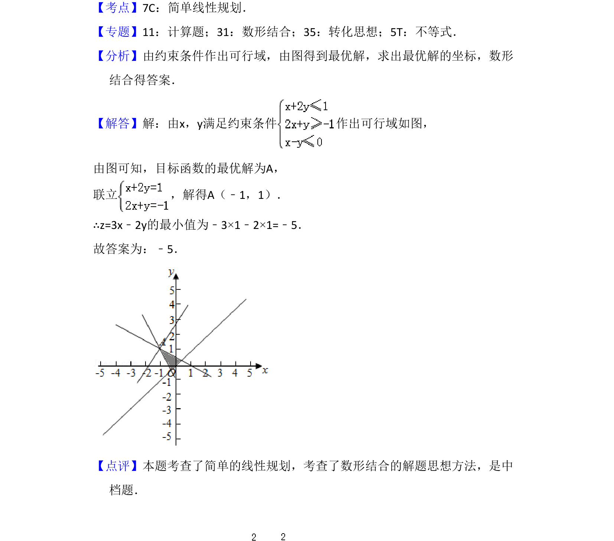

## 题面

## 摘要

考查线性约束条件下目标函数的最值问题，通过数形结合求最优解。

## 关联考点

- [[1074-简单线性规划|简单线性规划]]
- [[898-数形结合思想|数形结合思想]]

## 答案与解析

> 📄 原 PDF 第 14 页：`素材/真题/湖南/2008-2024·（湖南）数学高考真题/2017年高考数学试卷（理）（新课标Ⅰ）（解析卷）.pdf`

<!-- 题干文本-start -->
## 题干文本
14．（5分）设x，y满足约束条件 ，则z=3x﹣2y的最小值为　﹣5　．
<!-- 题干文本-end -->

<!-- 解析文本-start -->
## 解析文本
【考点】7C：简单线性规划．菁优网版权所有
【专题】11：计算题；31：数形结合；35：转化思想；5T：不等式．
【分析】由约束条件作出可行域，由图得到最优解，求出最优解的坐标，数形
结合得答案．
【解答】解：由x，y满足约束条件 作出可行域如图，
由图可知，目标函数的最优解为A，
联立 ，解得A（﹣1，1）．
∴z=3x﹣2y的最小值为﹣3×1﹣2×1=﹣5．
故答案为：﹣5．
【点评】本题考查了简单的线性规划，考查了数形结合的解题思想方法，是中
档题．
<!-- 解析文本-end -->
